# Opinion Poll by Prósent for Morgunblaðið, 21 January–16 February 2026

<a href="#voting-intentions">Voting Intentions</a> | <a href="#seats">Seats</a> | <a href="#coalitions">Coalitions</a> | <a href="#technical-information">Technical Information</a>

## Voting Intentions

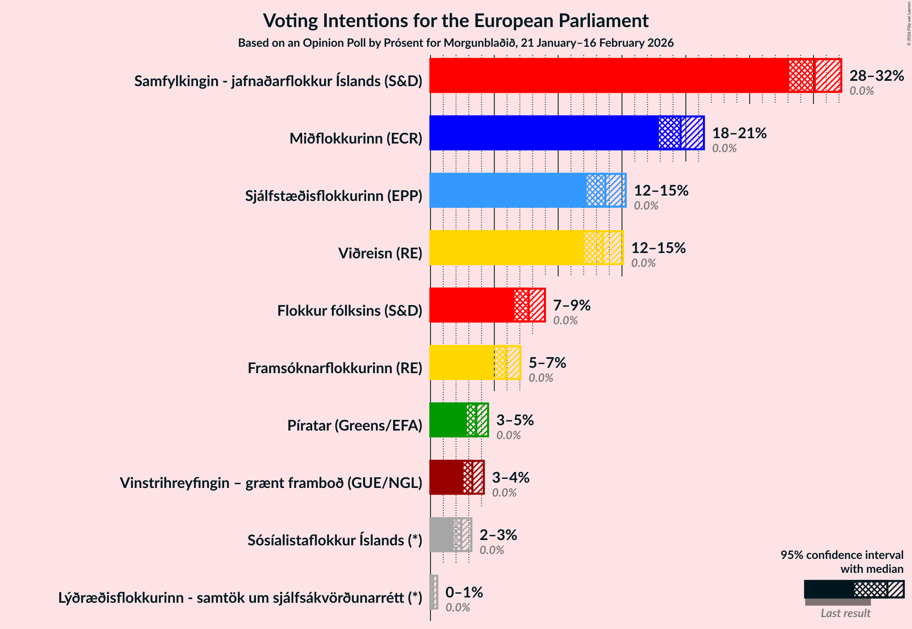

### Confidence Intervals

| Party | Last Result | Poll Result | 80% Confidence Interval | 90% Confidence Interval | 95% Confidence Interval | 99% Confidence Interval |
|:-----:|:-----------:|:-----------:|:-----------------------:|:-----------------------:|:-----------------------:|:-----------------------:|
| Samfylkingin - jafnaðarflokkur Íslands (S&D) | 0.0% | 30.1% | 28.8–31.5% |28.4–31.8% |28.1–32.2% |27.5–32.8% |
| Miðflokkurinn (ECR) | 0.0% | 19.6% | 18.5–20.8% |18.2–21.1% |17.9–21.4% |17.4–22.0% |
| Sjálfstæðisflokkurinn (EPP) | 0.0% | 13.7% | 12.7–14.7% |12.5–15.0% |12.2–15.3% |11.8–15.8% |
| Viðreisn (RE) | 0.0% | 13.5% | 12.5–14.5% |12.3–14.8% |12.0–15.1% |11.6–15.6% |
| Flokkur fólksins (S&D) | 0.0% | 7.7% | 7.0–8.5% |6.8–8.8% |6.6–9.0% |6.3–9.4% |
| Framsóknarflokkurinn (RE) | 0.0% | 5.9% | 5.3–6.6% |5.1–6.8% |4.9–7.0% |4.6–7.4% |
| Píratar (Greens/EFA) | 0.0% | 3.6% | 3.1–4.2% |3.0–4.4% |2.9–4.5% |2.6–4.8% |
| Vinstrihreyfingin – grænt framboð (GUE/NGL) | 0.0% | 3.3% | 2.8–3.9% |2.7–4.0% |2.6–4.2% |2.4–4.5% |
| Sósíalistaflokkur Íslands (*) | 0.0% | 2.4% | 2.0–2.9% |1.9–3.1% |1.8–3.2% |1.6–3.5% |
| Lýðræðisflokkurinn - samtök um sjálfsákvörðunarrétt (*) | 0.0% | 0.2% | 0.1–0.4% |0.1–0.5% |0.1–0.5% |0.0–0.7% |

*Note:* The poll result column reflects the actual value used in the calculations. Published results may vary slightly, and in addition be rounded to fewer digits.

## Seats

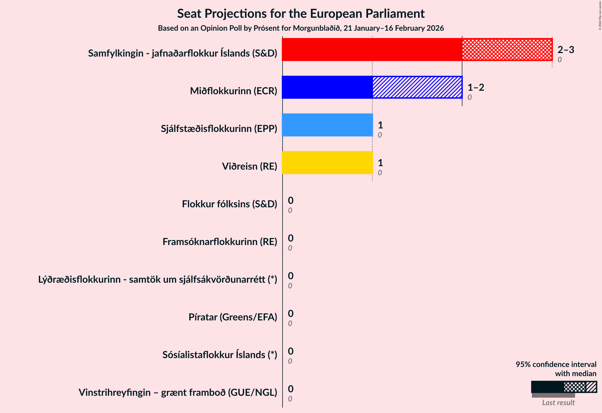

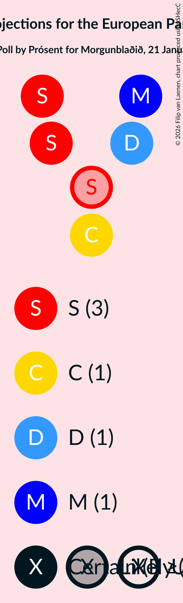

### Confidence Intervals

| Party | Last Result | Median | 80% Confidence Interval | 90% Confidence Interval | 95% Confidence Interval | 99% Confidence Interval |
|:-----:|:-----------:|:------:|:-----------------------:|:-----------------------:|:-----------------------:|:-----------------------:|
| <a href="#samfylkingin---jafnaðarflokkur-íslands-(s&d)">Samfylkingin - jafnaðarflokkur Íslands (S&D)</a> | 0 | 3 | 2–3 |2–3 |2–3 |2–3 |
| <a href="#miðflokkurinn-(ecr)">Miðflokkurinn (ECR)</a> | 0 | 1 | 1–2 |1–2 |1–2 |1–2 |
| <a href="#sjálfstæðisflokkurinn-(epp)">Sjálfstæðisflokkurinn (EPP)</a> | 0 | 1 | 1 |1 |1 |1 |
| <a href="#viðreisn-(re)">Viðreisn (RE)</a> | 0 | 1 | 1 |1 |1 |1 |
| <a href="#flokkur-fólksins-(s&d)">Flokkur fólksins (S&D)</a> | 0 | 0 | 0 |0 |0 |0 |
| <a href="#framsóknarflokkurinn-(re)">Framsóknarflokkurinn (RE)</a> | 0 | 0 | 0 |0 |0 |0 |
| <a href="#píratar-(greens/efa)">Píratar (Greens/EFA)</a> | 0 | 0 | 0 |0 |0 |0 |
| <a href="#vinstrihreyfingin-–-grænt-framboð-(gue/ngl)">Vinstrihreyfingin – grænt framboð (GUE/NGL)</a> | 0 | 0 | 0 |0 |0 |0 |
| <a href="#sósíalistaflokkur-íslands-(*)">Sósíalistaflokkur Íslands (*)</a> | 0 | 0 | 0 |0 |0 |0 |
| <a href="#lýðræðisflokkurinn---samtök-um-sjálfsákvörðunarrétt-(*)">Lýðræðisflokkurinn - samtök um sjálfsákvörðunarrétt (*)</a> | 0 | 0 | 0 |0 |0 |0 |

### Samfylkingin - jafnaðarflokkur Íslands (S&D)

*For a full overview of the results for this party, see the [Samfylkingin - jafnaðarflokkur Íslands (S&D)](party-samfylkingin-jafnaðarflokkuríslandssd.html) page.*

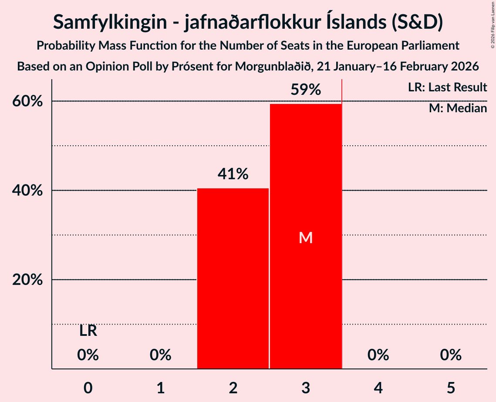

| Number of Seats | Probability | Accumulated | Special Marks |
|:---------------:|:-----------:|:-----------:|:-------------:|
| 0 | 0% | 100% | Last Result |
| 1 | 0% | 100% |  |
| 2 | 41% | 100% |  |
| 3 | 59% | 59% | Median |
| 4 | 0% | 0% | Majority |

### Miðflokkurinn (ECR)

*For a full overview of the results for this party, see the [Miðflokkurinn (ECR)](party-miðflokkurinnecr.html) page.*

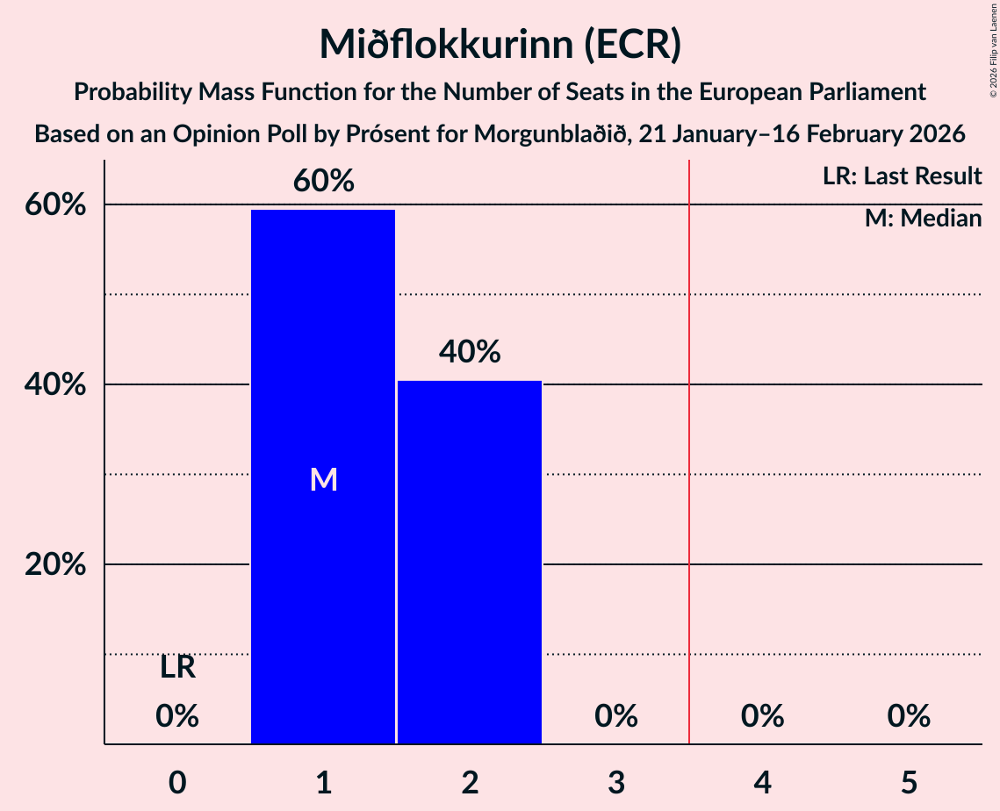

| Number of Seats | Probability | Accumulated | Special Marks |
|:---------------:|:-----------:|:-----------:|:-------------:|
| 0 | 0% | 100% | Last Result |
| 1 | 60% | 100% | Median |
| 2 | 40% | 40% |  |
| 3 | 0% | 0% |  |

### Sjálfstæðisflokkurinn (EPP)

*For a full overview of the results for this party, see the [Sjálfstæðisflokkurinn (EPP)](party-sjálfstæðisflokkurinnepp.html) page.*

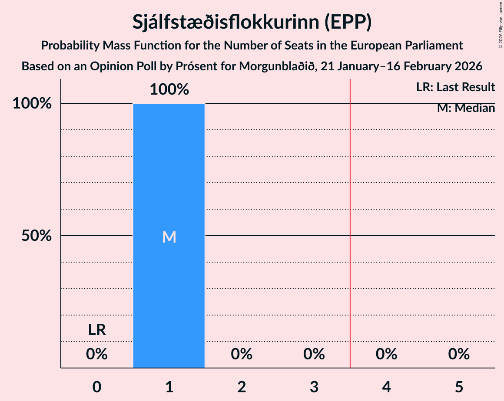

| Number of Seats | Probability | Accumulated | Special Marks |
|:---------------:|:-----------:|:-----------:|:-------------:|
| 0 | 0% | 100% | Last Result |
| 1 | 100% | 100% | Median |

### Viðreisn (RE)

*For a full overview of the results for this party, see the [Viðreisn (RE)](party-viðreisnre.html) page.*

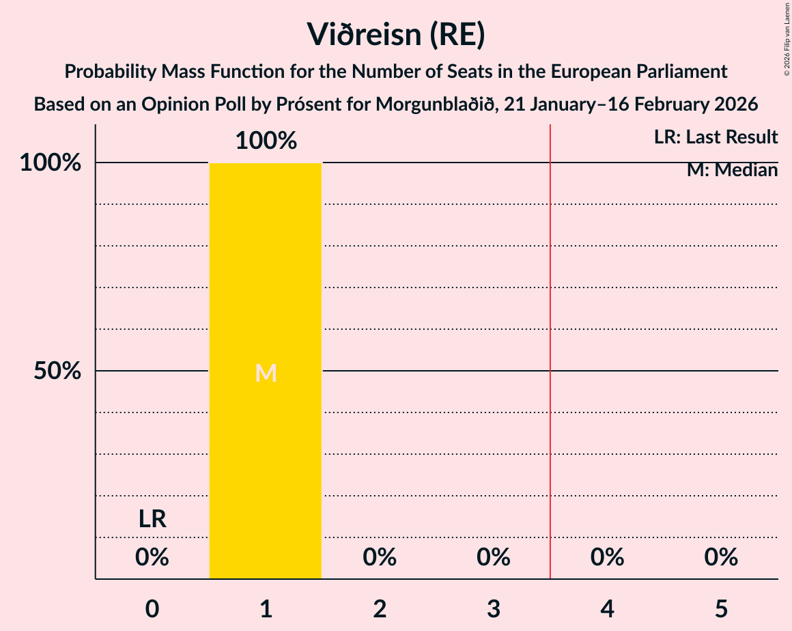

| Number of Seats | Probability | Accumulated | Special Marks |
|:---------------:|:-----------:|:-----------:|:-------------:|
| 0 | 0% | 100% | Last Result |
| 1 | 100% | 100% | Median |

### Flokkur fólksins (S&D)

*For a full overview of the results for this party, see the [Flokkur fólksins (S&D)](party-flokkurfólksinssd.html) page.*

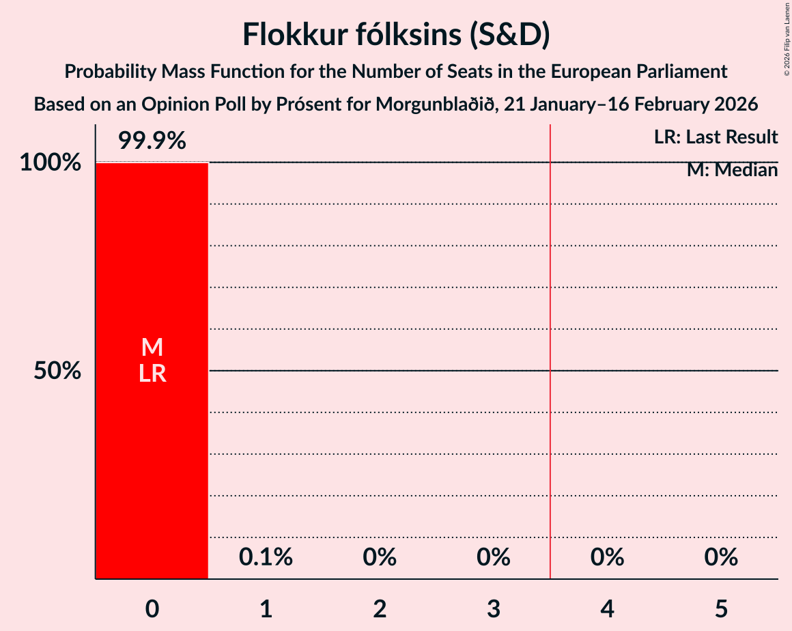

| Number of Seats | Probability | Accumulated | Special Marks |
|:---------------:|:-----------:|:-----------:|:-------------:|
| 0 | 99.9% | 100% | Last Result, Median |
| 1 | 0.1% | 0.1% |  |
| 2 | 0% | 0% |  |

### Framsóknarflokkurinn (RE)

*For a full overview of the results for this party, see the [Framsóknarflokkurinn (RE)](party-framsóknarflokkurinnre.html) page.*

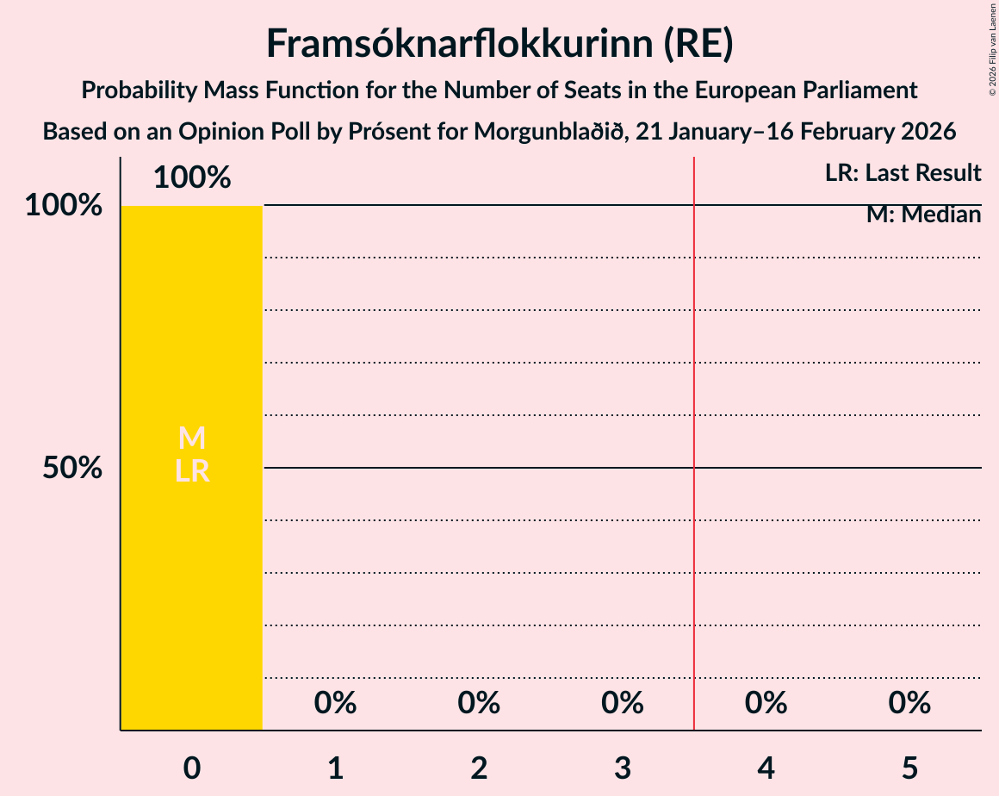

| Number of Seats | Probability | Accumulated | Special Marks |
|:---------------:|:-----------:|:-----------:|:-------------:|
| 0 | 100% | 100% | Last Result, Median |

### Píratar (Greens/EFA)

*For a full overview of the results for this party, see the [Píratar (Greens/EFA)](party-píratargreensefa.html) page.*

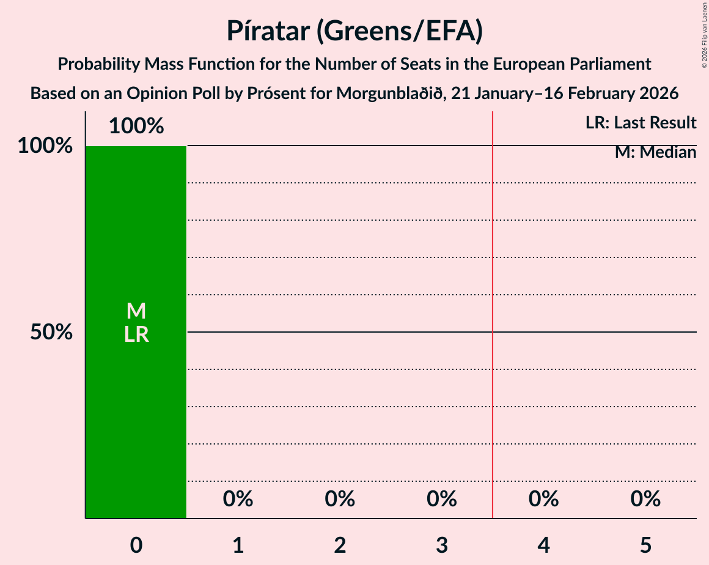

| Number of Seats | Probability | Accumulated | Special Marks |
|:---------------:|:-----------:|:-----------:|:-------------:|
| 0 | 100% | 100% | Last Result, Median |

### Vinstrihreyfingin – grænt framboð (GUE/NGL)

*For a full overview of the results for this party, see the [Vinstrihreyfingin – grænt framboð (GUE/NGL)](party-vinstrihreyfingin–græntframboðguengl.html) page.*

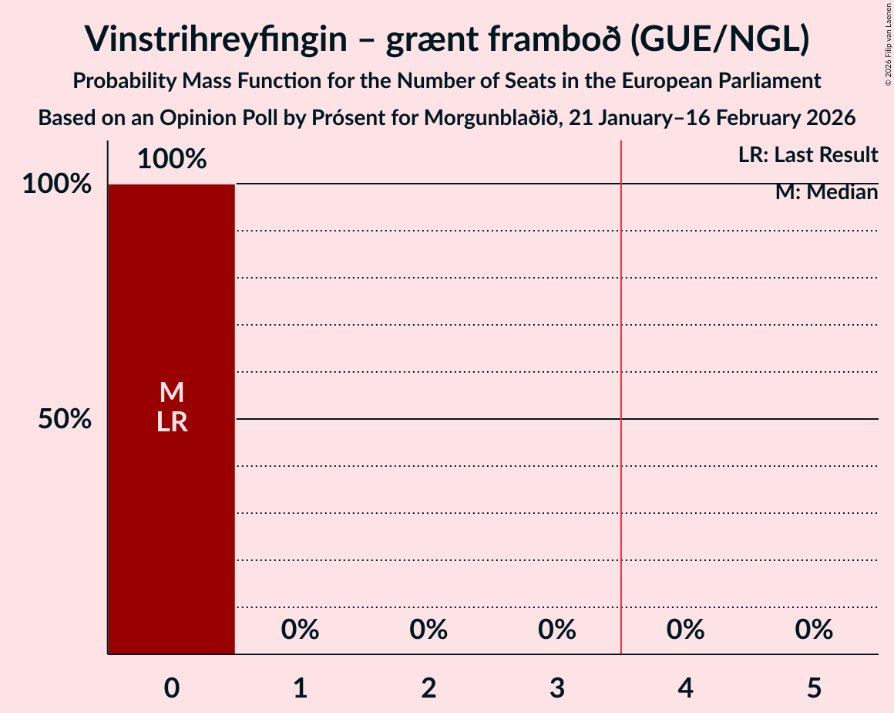

| Number of Seats | Probability | Accumulated | Special Marks |
|:---------------:|:-----------:|:-----------:|:-------------:|
| 0 | 100% | 100% | Last Result, Median |

### Sósíalistaflokkur Íslands (*)

*For a full overview of the results for this party, see the [Sósíalistaflokkur Íslands (*)](party-sósíalistaflokkuríslands.html) page.*

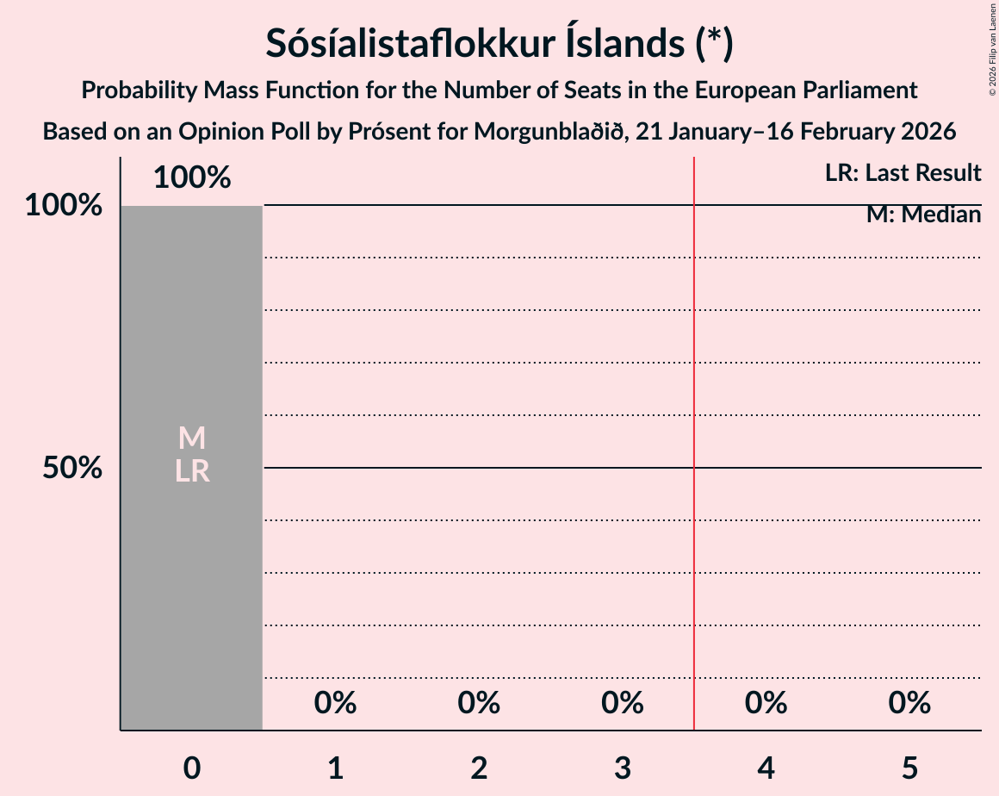

| Number of Seats | Probability | Accumulated | Special Marks |
|:---------------:|:-----------:|:-----------:|:-------------:|
| 0 | 100% | 100% | Last Result, Median |

### Lýðræðisflokkurinn - samtök um sjálfsákvörðunarrétt (*)

*For a full overview of the results for this party, see the [Lýðræðisflokkurinn - samtök um sjálfsákvörðunarrétt (*)](party-lýðræðisflokkurinn-samtökumsjálfsákvörðunarrétt.html) page.*

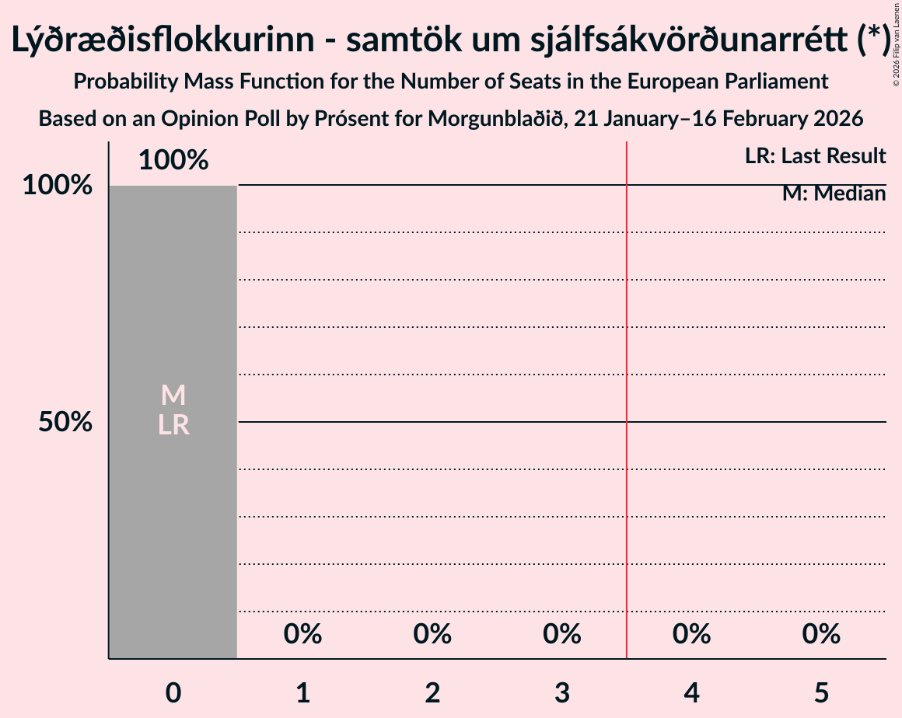

| Number of Seats | Probability | Accumulated | Special Marks |
|:---------------:|:-----------:|:-----------:|:-------------:|
| 0 | 100% | 100% | Last Result, Median |

## Coalitions

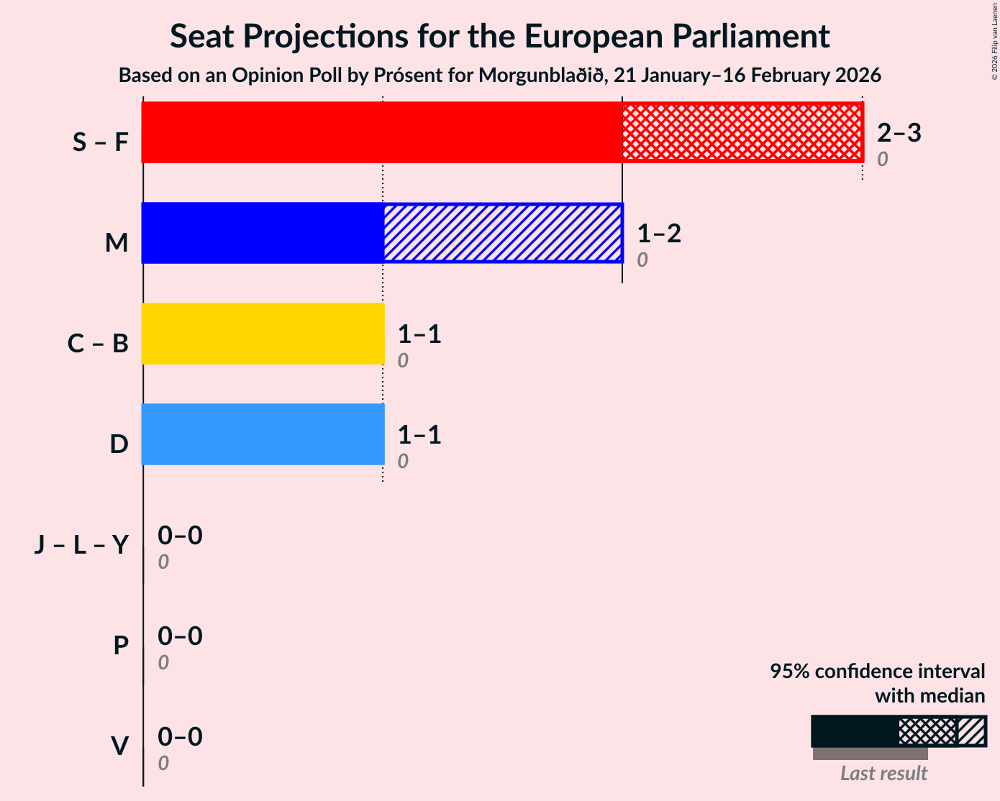

### Confidence Intervals

| Coalition | Last Result | Median | Majority? | 80% Confidence Interval | 90% Confidence Interval | 95% Confidence Interval | 99% Confidence Interval |
|:---------:|:-----------:|:------:|:---------:|:-----------------------:|:-----------------------:|:-----------------------:|:-----------------------:|
| Samfylkingin - jafnaðarflokkur Íslands (S&D) – Flokkur fólksins (S&D) | 0 | 3 | 0% | 2–3 | 2–3 | 2–3 | 2–3 |
| Miðflokkurinn (ECR) | 0 | 1 | 0% | 1–2 | 1–2 | 1–2 | 1–2 |
| Viðreisn (RE) – Framsóknarflokkurinn (RE) | 0 | 1 | 0% | 1 | 1 | 1 | 1 |
| Sjálfstæðisflokkurinn (EPP) | 0 | 1 | 0% | 1 | 1 | 1 | 1 |
| Píratar (Greens/EFA) | 0 | 0 | 0% | 0 | 0 | 0 | 0 |
| Vinstrihreyfingin – grænt framboð (GUE/NGL) | 0 | 0 | 0% | 0 | 0 | 0 | 0 |

### Samfylkingin - jafnaðarflokkur Íslands (S&D) – Flokkur fólksins (S&D)

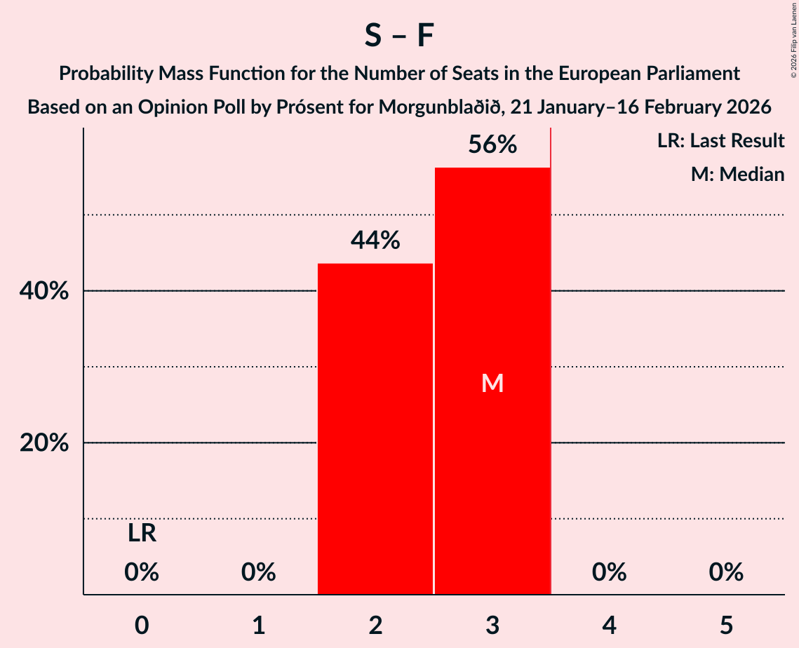

| Number of Seats | Probability | Accumulated | Special Marks |
|:---------------:|:-----------:|:-----------:|:-------------:|
| 0 | 0% | 100% | Last Result |
| 1 | 0% | 100% |  |
| 2 | 40% | 100% |  |
| 3 | 60% | 60% | Median |
| 4 | 0% | 0% | Majority |

### Miðflokkurinn (ECR)

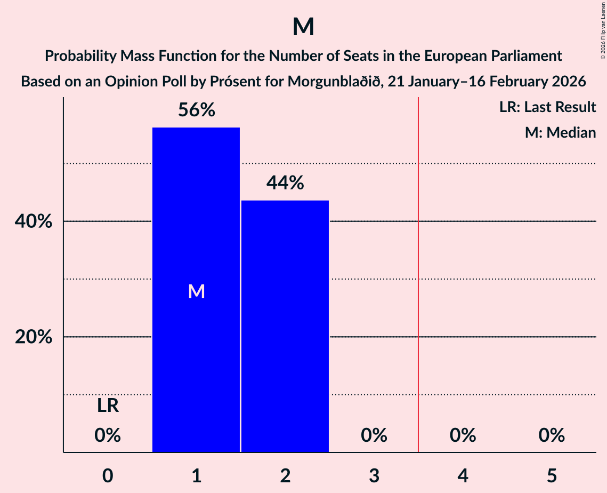

| Number of Seats | Probability | Accumulated | Special Marks |
|:---------------:|:-----------:|:-----------:|:-------------:|
| 0 | 0% | 100% | Last Result |
| 1 | 60% | 100% | Median |
| 2 | 40% | 40% |  |
| 3 | 0% | 0% |  |

### Viðreisn (RE) – Framsóknarflokkurinn (RE)

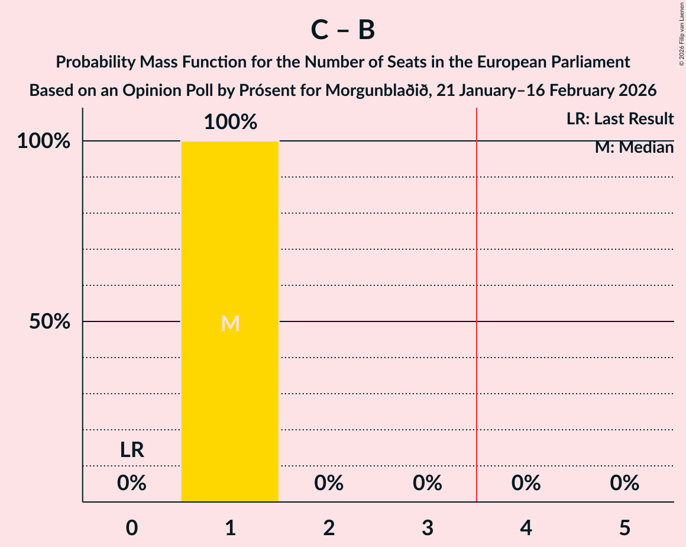

| Number of Seats | Probability | Accumulated | Special Marks |
|:---------------:|:-----------:|:-----------:|:-------------:|
| 0 | 0% | 100% | Last Result |
| 1 | 100% | 100% | Median |

### Sjálfstæðisflokkurinn (EPP)

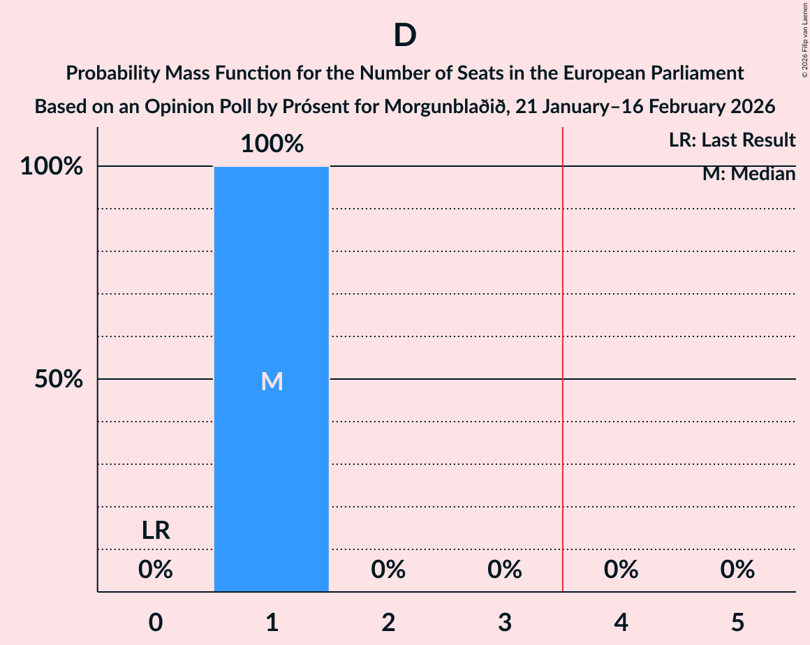

| Number of Seats | Probability | Accumulated | Special Marks |
|:---------------:|:-----------:|:-----------:|:-------------:|
| 0 | 0% | 100% | Last Result |
| 1 | 100% | 100% | Median |

### Píratar (Greens/EFA)

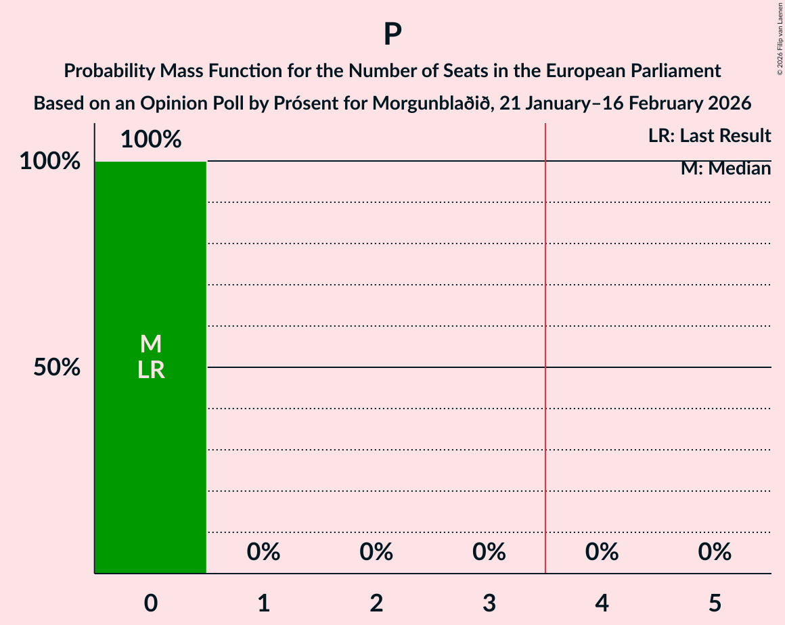

| Number of Seats | Probability | Accumulated | Special Marks |
|:---------------:|:-----------:|:-----------:|:-------------:|
| 0 | 100% | 100% | Last Result, Median |

### Vinstrihreyfingin – grænt framboð (GUE/NGL)

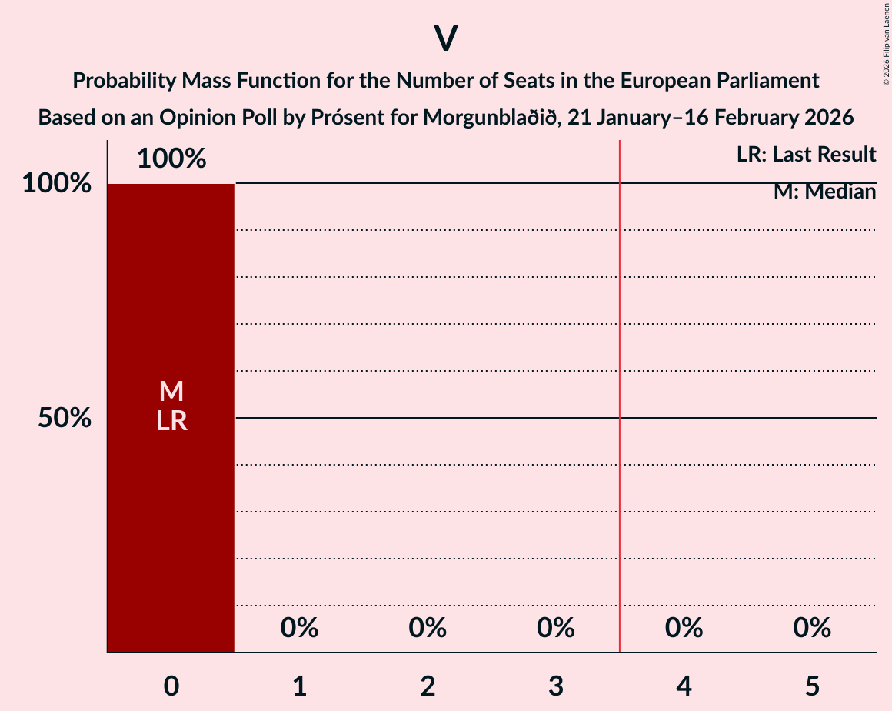

| Number of Seats | Probability | Accumulated | Special Marks |
|:---------------:|:-----------:|:-----------:|:-------------:|
| 0 | 100% | 100% | Last Result, Median |

## Technical Information

### Opinion Poll

+ **Polling firm:** Prósent
+ **Commissioner(s):** Morgunblaðið
+ **Fieldwork period:** 21 January–16 February 2026

### Calculations

+ **Sample size:** 1950
+ **Simulations done:** 2,097,152
+ **Error estimate:** 0.79%

