# Opinion Poll by Maskína for Vísir, 25 March–16 April 2026

<a href="#voting-intentions">Voting Intentions</a> | <a href="#seats">Seats</a> | <a href="#coalitions">Coalitions</a> | <a href="#technical-information">Technical Information</a>

## Voting Intentions

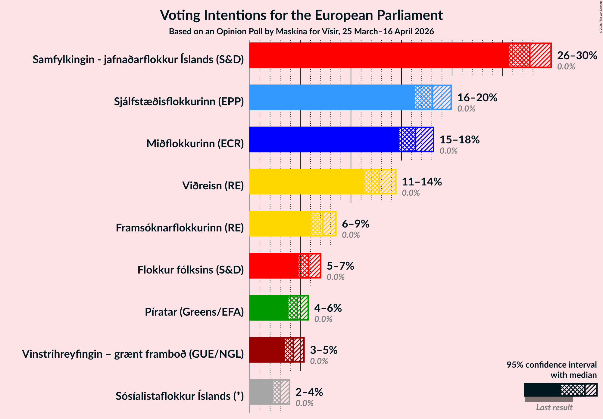

### Confidence Intervals

| Party | Last Result | Poll Result | 80% Confidence Interval | 90% Confidence Interval | 95% Confidence Interval | 99% Confidence Interval |
|:-----:|:-----------:|:-----------:|:-----------------------:|:-----------------------:|:-----------------------:|:-----------------------:|
| Samfylkingin - jafnaðarflokkur Íslands (S&D) | 0.0% | 27.7% | 26.4–29.1% |26.0–29.5% |25.7–29.8% |25.0–30.5% |
| Sjálfstæðisflokkurinn (EPP) | 0.0% | 18.1% | 16.9–19.3% |16.6–19.6% |16.4–19.9% |15.8–20.5% |
| Miðflokkurinn (ECR) | 0.0% | 16.4% | 15.3–17.6% |15.0–17.9% |14.7–18.2% |14.2–18.7% |
| Viðreisn (RE) | 0.0% | 12.8% | 11.8–13.9% |11.6–14.2% |11.3–14.4% |10.9–15.0% |
| Framsóknarflokkurinn (RE) | 0.0% | 7.2% | 6.5–8.1% |6.3–8.3% |6.1–8.5% |5.8–8.9% |
| Flokkur fólksins (S&D) | 0.0% | 5.8% | 5.2–6.6% |5.0–6.8% |4.8–7.0% |4.5–7.4% |
| Píratar (Greens/EFA) | 0.0% | 4.7% | 4.1–5.4% |3.9–5.6% |3.8–5.8% |3.6–6.1% |
| Vinstrihreyfingin – grænt framboð (GUE/NGL) | 0.0% | 4.3% | 3.7–5.0% |3.6–5.2% |3.5–5.3% |3.2–5.7% |
| Sósíalistaflokkur Íslands (*) | 0.0% | 3.0% | 2.6–3.6% |2.4–3.8% |2.3–3.9% |2.1–4.2% |

*Note:* The poll result column reflects the actual value used in the calculations. Published results may vary slightly, and in addition be rounded to fewer digits.

## Seats

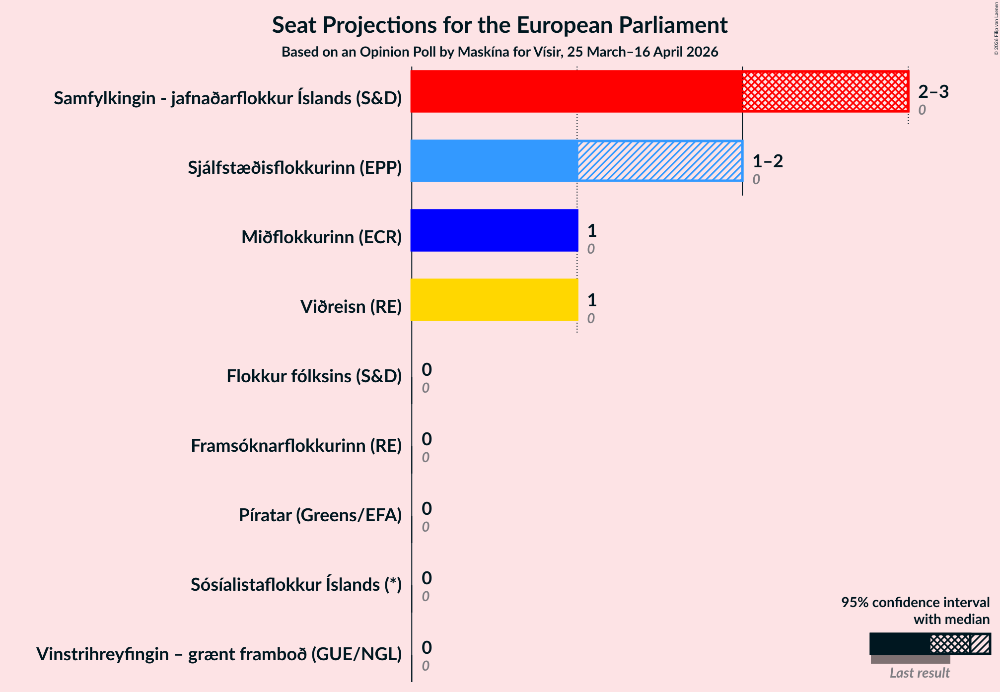

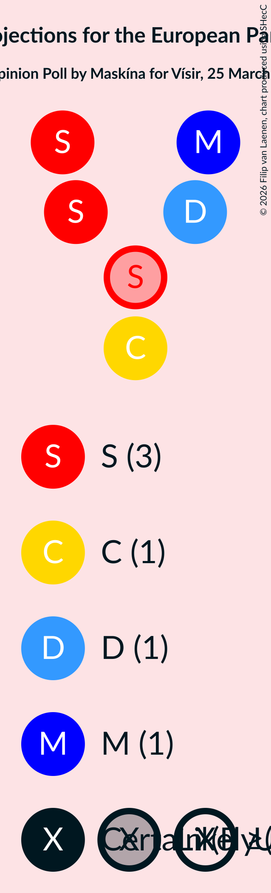

### Confidence Intervals

| Party | Last Result | Median | 80% Confidence Interval | 90% Confidence Interval | 95% Confidence Interval | 99% Confidence Interval |
|:-----:|:-----------:|:------:|:-----------------------:|:-----------------------:|:-----------------------:|:-----------------------:|
| <a href="#samfylkingin---jafnaðarflokkur-íslands-(s&d)">Samfylkingin - jafnaðarflokkur Íslands (S&D)</a> | 0 | 3 | 2–3 |2–3 |2–3 |2–3 |
| <a href="#sjálfstæðisflokkurinn-(epp)">Sjálfstæðisflokkurinn (EPP)</a> | 0 | 1 | 1–2 |1–2 |1–2 |1–2 |
| <a href="#miðflokkurinn-(ecr)">Miðflokkurinn (ECR)</a> | 0 | 1 | 1 |1 |1 |1–2 |
| <a href="#viðreisn-(re)">Viðreisn (RE)</a> | 0 | 1 | 1 |1 |1 |1 |
| <a href="#framsóknarflokkurinn-(re)">Framsóknarflokkurinn (RE)</a> | 0 | 0 | 0 |0 |0 |0 |
| <a href="#flokkur-fólksins-(s&d)">Flokkur fólksins (S&D)</a> | 0 | 0 | 0 |0 |0 |0 |
| <a href="#píratar-(greens/efa)">Píratar (Greens/EFA)</a> | 0 | 0 | 0 |0 |0 |0 |
| <a href="#vinstrihreyfingin-–-grænt-framboð-(gue/ngl)">Vinstrihreyfingin – grænt framboð (GUE/NGL)</a> | 0 | 0 | 0 |0 |0 |0 |
| <a href="#sósíalistaflokkur-íslands-(*)">Sósíalistaflokkur Íslands (*)</a> | 0 | 0 | 0 |0 |0 |0 |

### Samfylkingin - jafnaðarflokkur Íslands (S&D)

*For a full overview of the results for this party, see the [Samfylkingin - jafnaðarflokkur Íslands (S&D)](party-samfylkingin-jafnaðarflokkuríslandssd.html) page.*

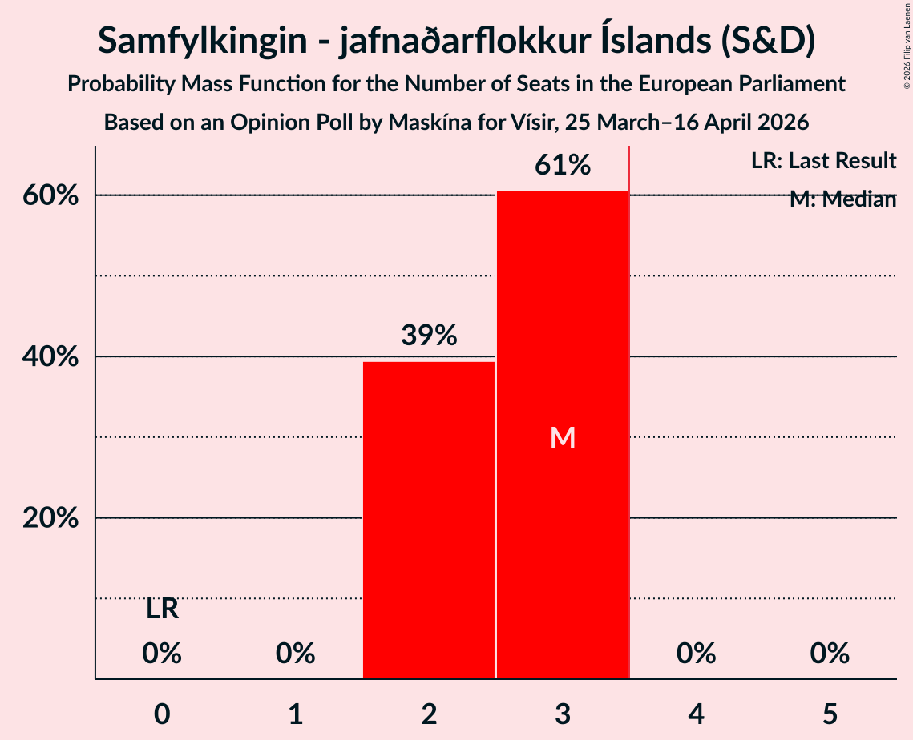

| Number of Seats | Probability | Accumulated | Special Marks |
|:---------------:|:-----------:|:-----------:|:-------------:|
| 0 | 0% | 100% | Last Result |
| 1 | 0% | 100% |  |
| 2 | 42% | 100% |  |
| 3 | 58% | 58% | Median |
| 4 | 0% | 0% | Majority |

### Sjálfstæðisflokkurinn (EPP)

*For a full overview of the results for this party, see the [Sjálfstæðisflokkurinn (EPP)](party-sjálfstæðisflokkurinnepp.html) page.*

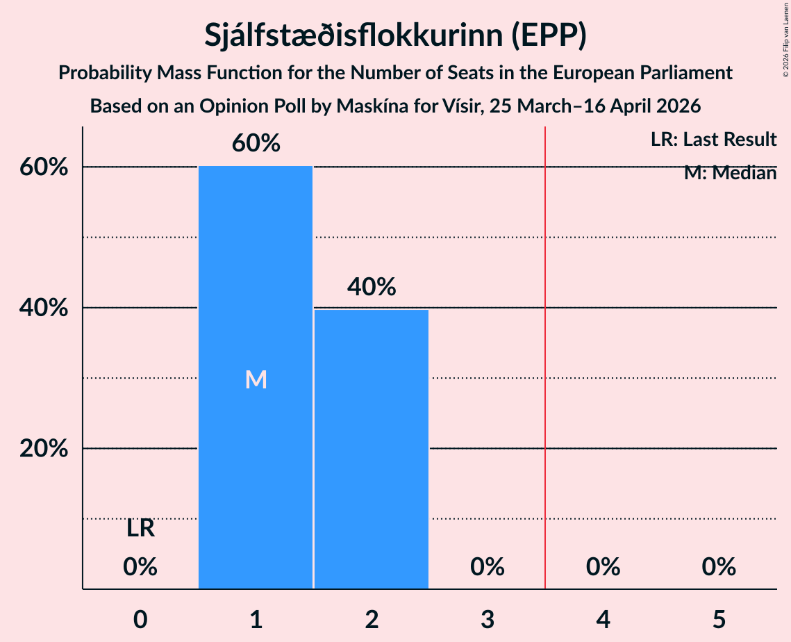

| Number of Seats | Probability | Accumulated | Special Marks |
|:---------------:|:-----------:|:-----------:|:-------------:|
| 0 | 0% | 100% | Last Result |
| 1 | 60% | 100% | Median |
| 2 | 40% | 40% |  |
| 3 | 0% | 0% |  |

### Miðflokkurinn (ECR)

*For a full overview of the results for this party, see the [Miðflokkurinn (ECR)](party-miðflokkurinnecr.html) page.*

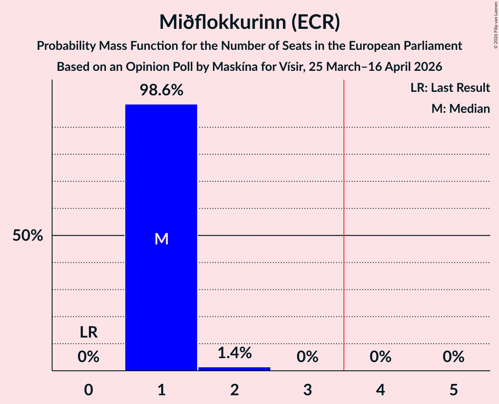

| Number of Seats | Probability | Accumulated | Special Marks |
|:---------------:|:-----------:|:-----------:|:-------------:|
| 0 | 0% | 100% | Last Result |
| 1 | 98% | 100% | Median |
| 2 | 2% | 2% |  |
| 3 | 0% | 0% |  |

### Viðreisn (RE)

*For a full overview of the results for this party, see the [Viðreisn (RE)](party-viðreisnre.html) page.*

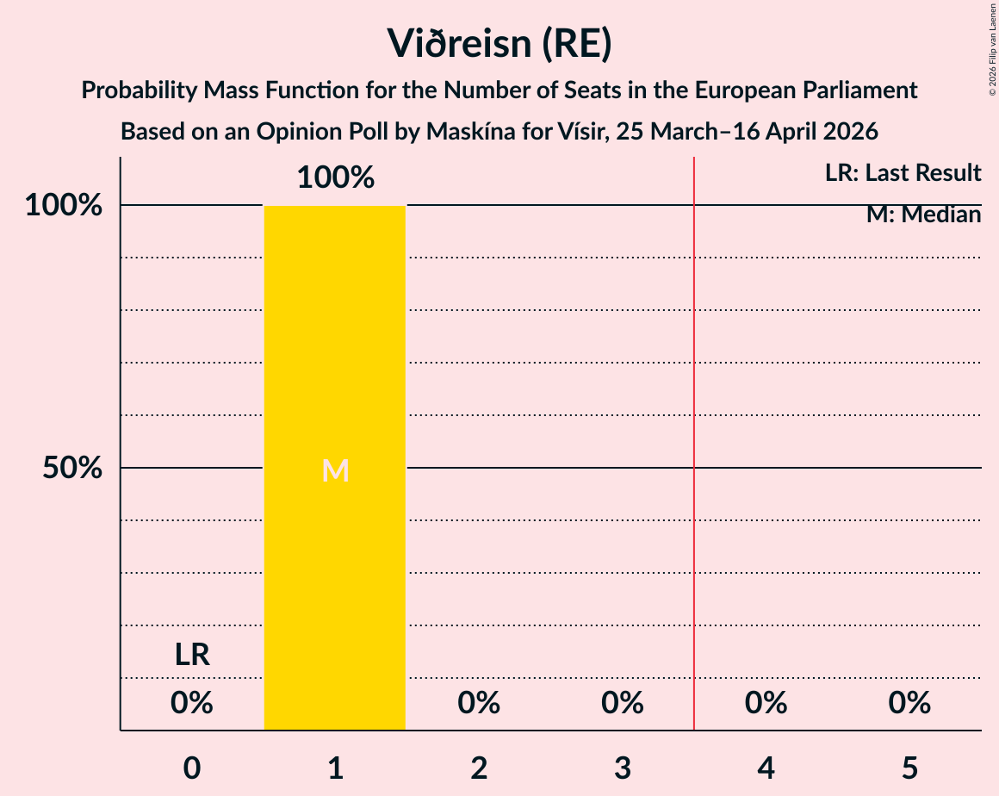

| Number of Seats | Probability | Accumulated | Special Marks |
|:---------------:|:-----------:|:-----------:|:-------------:|
| 0 | 0% | 100% | Last Result |
| 1 | 100% | 100% | Median |

### Framsóknarflokkurinn (RE)

*For a full overview of the results for this party, see the [Framsóknarflokkurinn (RE)](party-framsóknarflokkurinnre.html) page.*

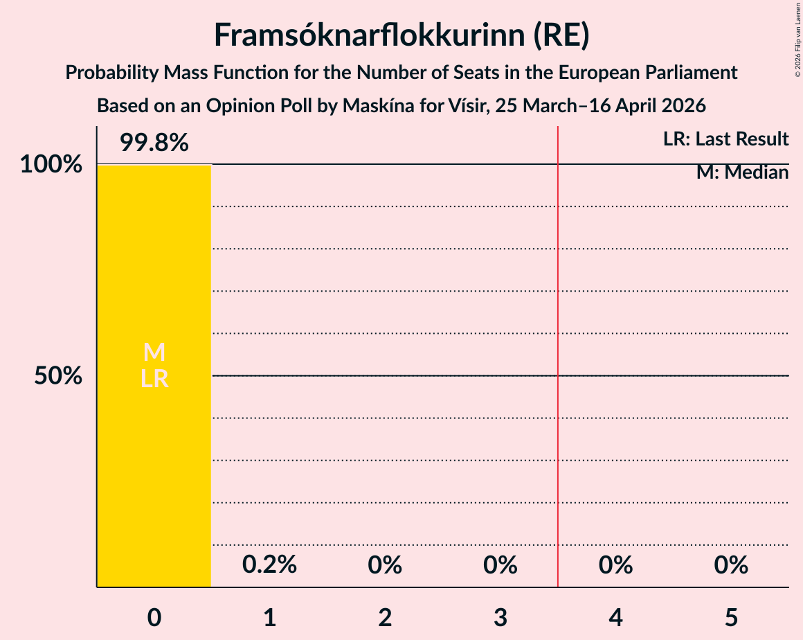

| Number of Seats | Probability | Accumulated | Special Marks |
|:---------------:|:-----------:|:-----------:|:-------------:|
| 0 | 99.8% | 100% | Last Result, Median |
| 1 | 0.2% | 0.2% |  |
| 2 | 0% | 0% |  |

### Flokkur fólksins (S&D)

*For a full overview of the results for this party, see the [Flokkur fólksins (S&D)](party-flokkurfólksinssd.html) page.*

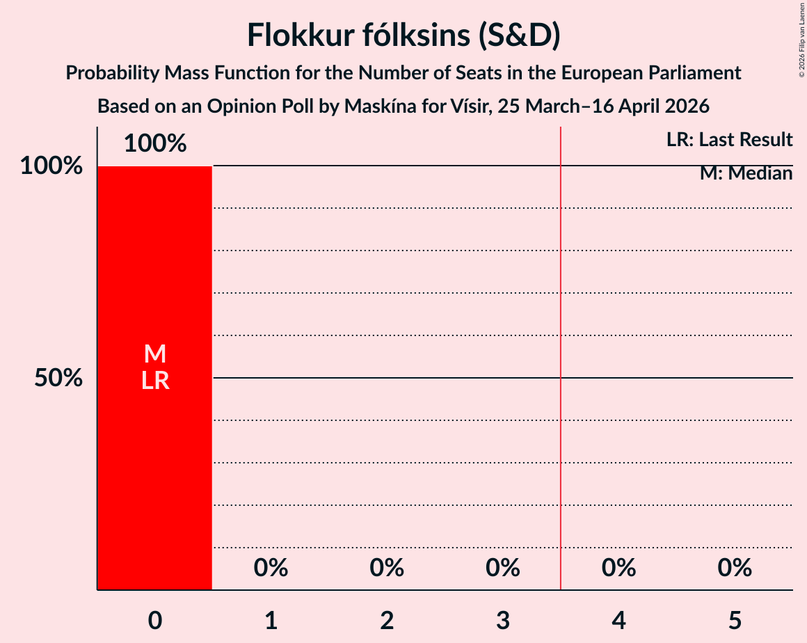

| Number of Seats | Probability | Accumulated | Special Marks |
|:---------------:|:-----------:|:-----------:|:-------------:|
| 0 | 100% | 100% | Last Result, Median |

### Píratar (Greens/EFA)

*For a full overview of the results for this party, see the [Píratar (Greens/EFA)](party-píratargreensefa.html) page.*

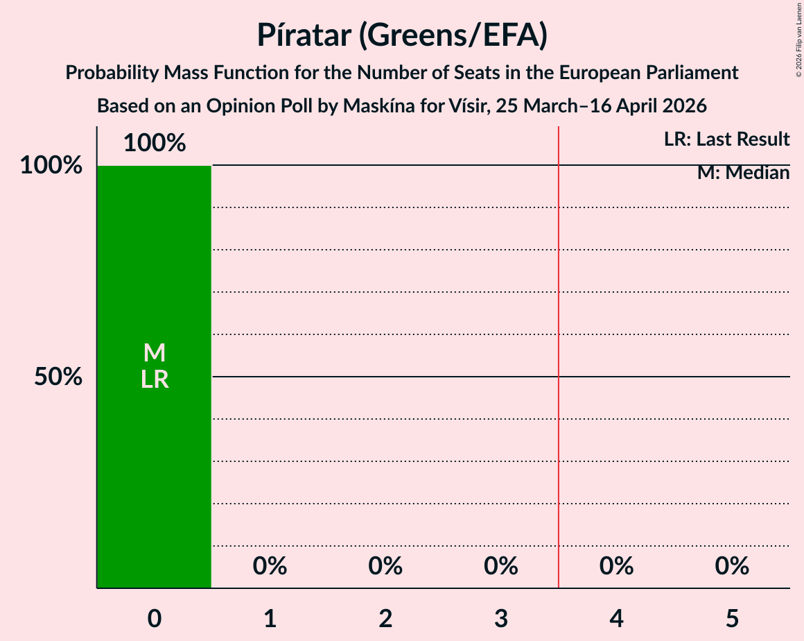

| Number of Seats | Probability | Accumulated | Special Marks |
|:---------------:|:-----------:|:-----------:|:-------------:|
| 0 | 100% | 100% | Last Result, Median |

### Vinstrihreyfingin – grænt framboð (GUE/NGL)

*For a full overview of the results for this party, see the [Vinstrihreyfingin – grænt framboð (GUE/NGL)](party-vinstrihreyfingin–græntframboðguengl.html) page.*

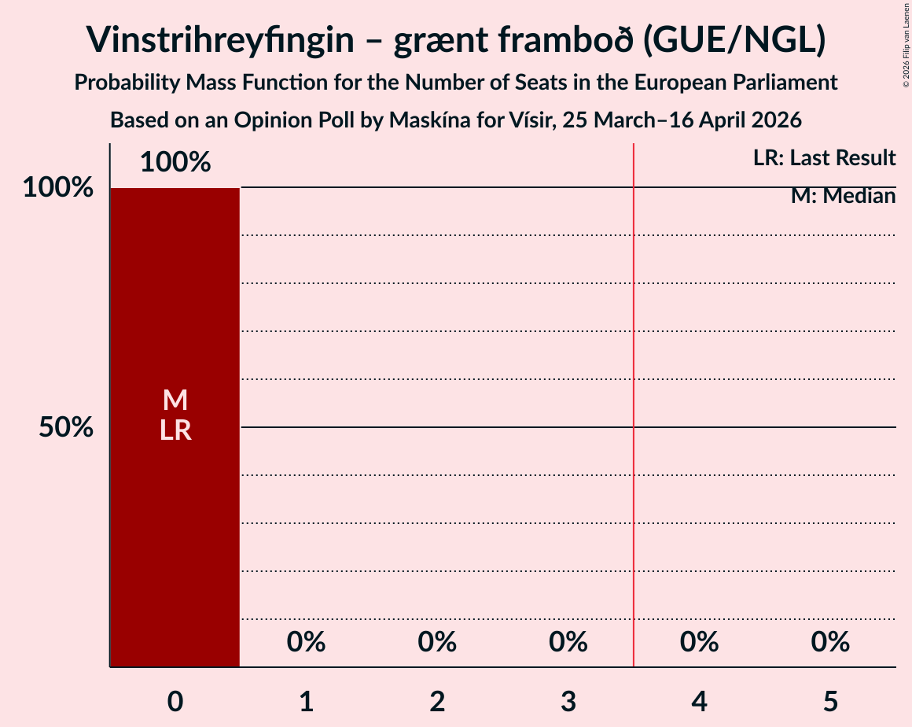

| Number of Seats | Probability | Accumulated | Special Marks |
|:---------------:|:-----------:|:-----------:|:-------------:|
| 0 | 100% | 100% | Last Result, Median |

### Sósíalistaflokkur Íslands (*)

*For a full overview of the results for this party, see the [Sósíalistaflokkur Íslands (*)](party-sósíalistaflokkuríslands.html) page.*

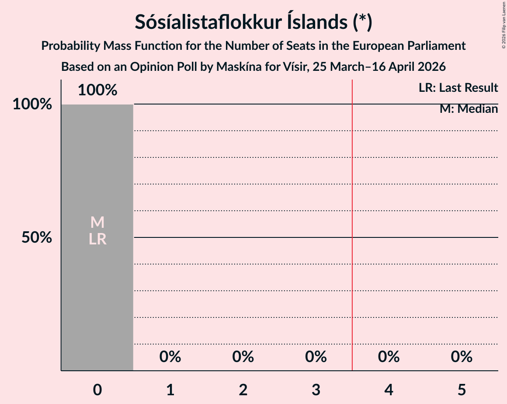

| Number of Seats | Probability | Accumulated | Special Marks |
|:---------------:|:-----------:|:-----------:|:-------------:|
| 0 | 100% | 100% | Last Result, Median |

## Coalitions

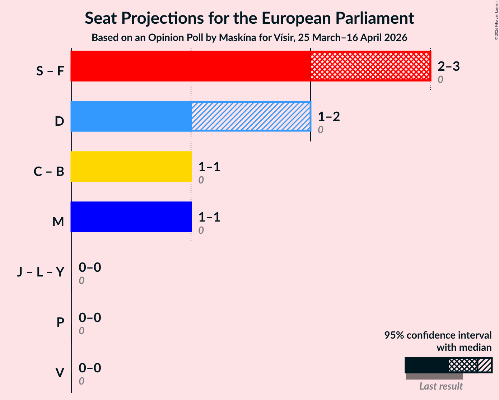

### Confidence Intervals

| Coalition | Last Result | Median | Majority? | 80% Confidence Interval | 90% Confidence Interval | 95% Confidence Interval | 99% Confidence Interval |
|:---------:|:-----------:|:------:|:---------:|:-----------------------:|:-----------------------:|:-----------------------:|:-----------------------:|
| Samfylkingin - jafnaðarflokkur Íslands (S&D) – Flokkur fólksins (S&D) | 0 | 3 | 0% | 2–3 | 2–3 | 2–3 | 2–3 |
| Sjálfstæðisflokkurinn (EPP) | 0 | 1 | 0% | 1–2 | 1–2 | 1–2 | 1–2 |
| Viðreisn (RE) – Framsóknarflokkurinn (RE) | 0 | 1 | 0% | 1 | 1 | 1 | 1 |
| Miðflokkurinn (ECR) | 0 | 1 | 0% | 1 | 1 | 1 | 1–2 |
| Píratar (Greens/EFA) | 0 | 0 | 0% | 0 | 0 | 0 | 0 |
| Vinstrihreyfingin – grænt framboð (GUE/NGL) | 0 | 0 | 0% | 0 | 0 | 0 | 0 |

### Samfylkingin - jafnaðarflokkur Íslands (S&D) – Flokkur fólksins (S&D)

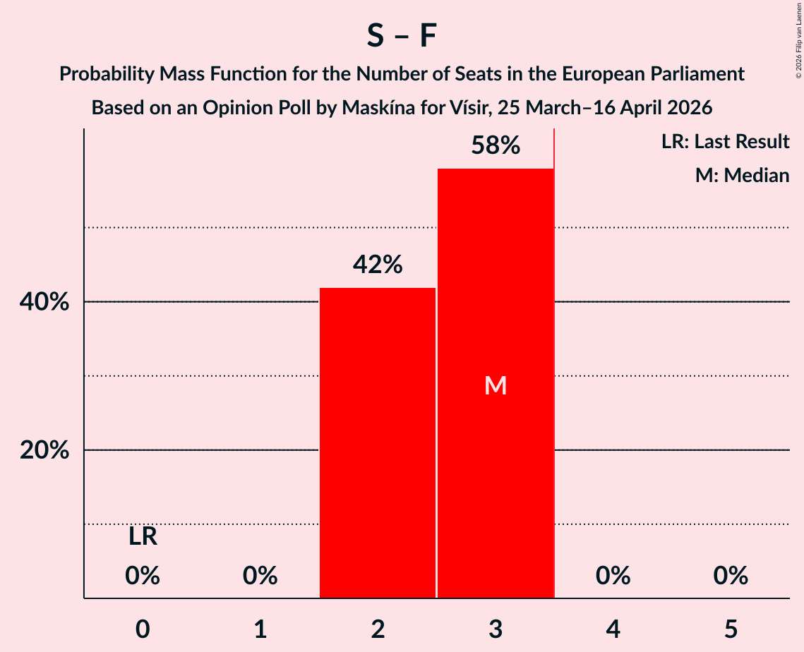

| Number of Seats | Probability | Accumulated | Special Marks |
|:---------------:|:-----------:|:-----------:|:-------------:|
| 0 | 0% | 100% | Last Result |
| 1 | 0% | 100% |  |
| 2 | 42% | 100% |  |
| 3 | 58% | 58% | Median |
| 4 | 0% | 0% | Majority |

### Sjálfstæðisflokkurinn (EPP)

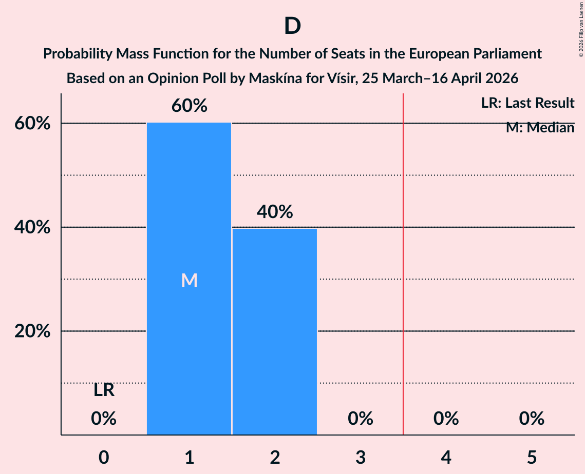

| Number of Seats | Probability | Accumulated | Special Marks |
|:---------------:|:-----------:|:-----------:|:-------------:|
| 0 | 0% | 100% | Last Result |
| 1 | 60% | 100% | Median |
| 2 | 40% | 40% |  |
| 3 | 0% | 0% |  |

### Viðreisn (RE) – Framsóknarflokkurinn (RE)

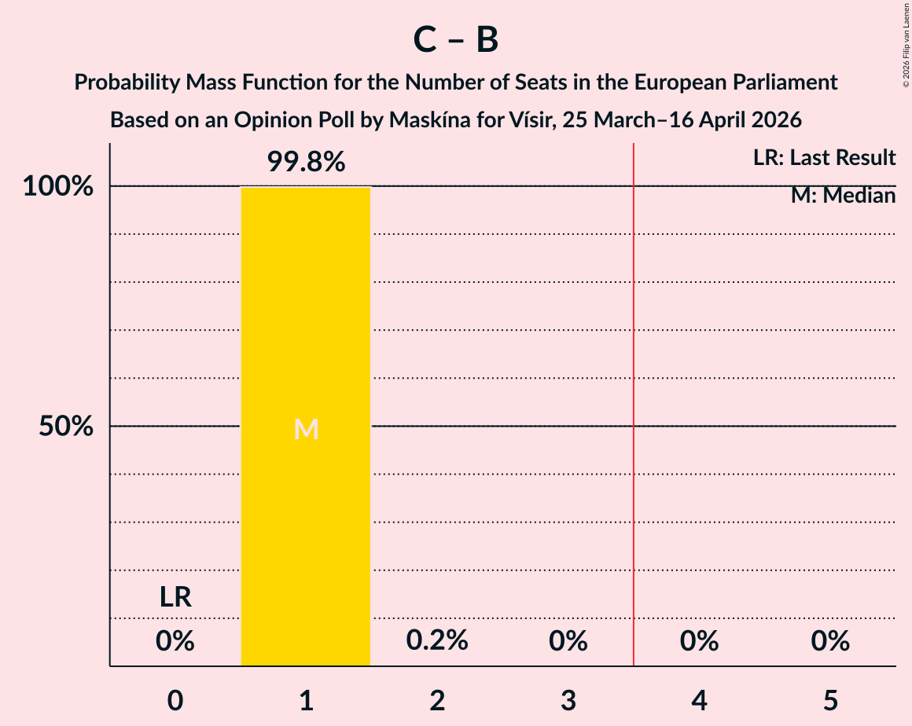

| Number of Seats | Probability | Accumulated | Special Marks |
|:---------------:|:-----------:|:-----------:|:-------------:|
| 0 | 0% | 100% | Last Result |
| 1 | 99.8% | 100% | Median |
| 2 | 0.2% | 0.2% |  |
| 3 | 0% | 0% |  |

### Miðflokkurinn (ECR)

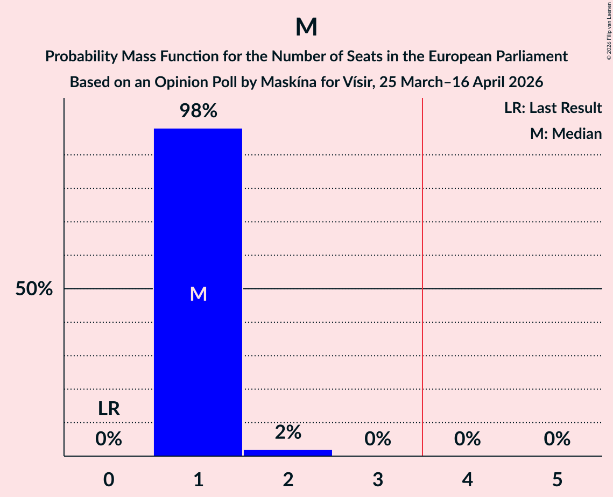

| Number of Seats | Probability | Accumulated | Special Marks |
|:---------------:|:-----------:|:-----------:|:-------------:|
| 0 | 0% | 100% | Last Result |
| 1 | 98% | 100% | Median |
| 2 | 2% | 2% |  |
| 3 | 0% | 0% |  |

### Píratar (Greens/EFA)

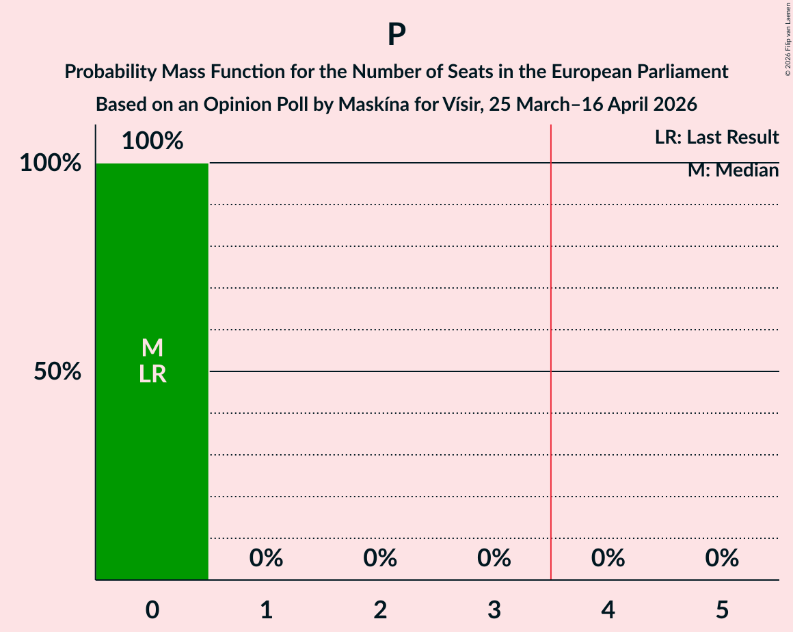

| Number of Seats | Probability | Accumulated | Special Marks |
|:---------------:|:-----------:|:-----------:|:-------------:|
| 0 | 100% | 100% | Last Result, Median |

### Vinstrihreyfingin – grænt framboð (GUE/NGL)

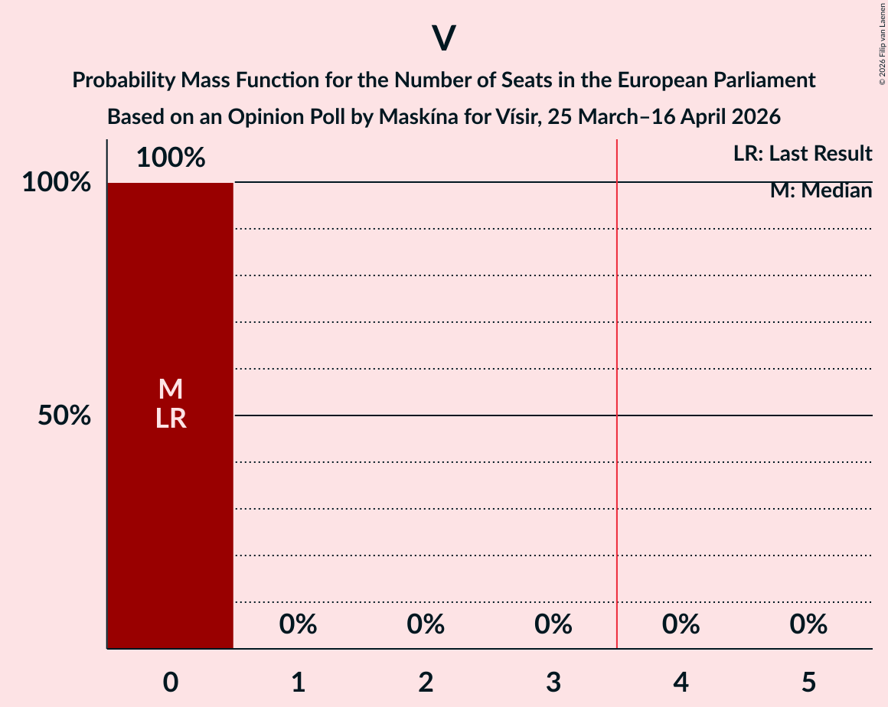

| Number of Seats | Probability | Accumulated | Special Marks |
|:---------------:|:-----------:|:-----------:|:-------------:|
| 0 | 100% | 100% | Last Result, Median |

## Technical Information

### Opinion Poll

+ **Polling firm:** Maskína
+ **Commissioner(s):** Vísir
+ **Fieldwork period:** 25 March–16 April 2026

### Calculations

+ **Sample size:** 1788
+ **Simulations done:** 1,048,576
+ **Error estimate:** 1.55%

