# Opinion Poll by Gallup for RÚV, 1–29 April 2026

<a href="#voting-intentions">Voting Intentions</a> | <a href="#seats">Seats</a> | <a href="#coalitions">Coalitions</a> | <a href="#technical-information">Technical Information</a>

## Voting Intentions

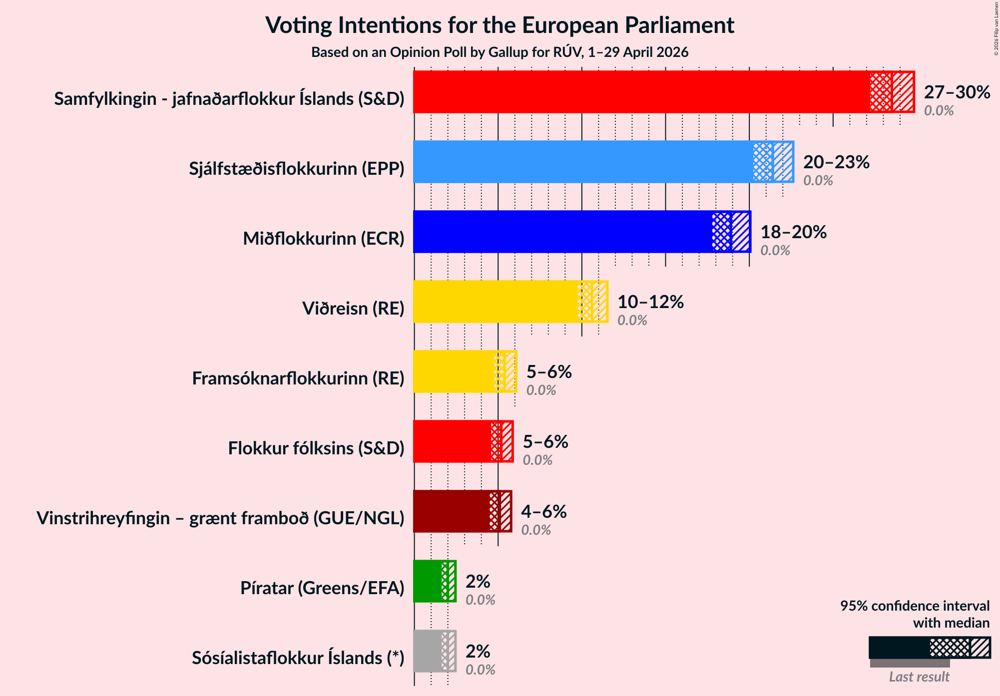

### Confidence Intervals

| Party | Last Result | Poll Result | 80% Confidence Interval | 90% Confidence Interval | 95% Confidence Interval | 99% Confidence Interval |
|:-----:|:-----------:|:-----------:|:-----------------------:|:-----------------------:|:-----------------------:|:-----------------------:|
| Samfylkingin - jafnaðarflokkur Íslands (S&D) | 0.0% | 28.5% | 27.7–29.4% |27.4–29.6% |27.2–29.8% |26.8–30.3% |
| Sjálfstæðisflokkurinn (EPP) | 0.0% | 21.4% | 20.6–22.2% |20.4–22.4% |20.2–22.6% |19.9–23.0% |
| Miðflokkurinn (ECR) | 0.0% | 18.9% | 18.2–19.7% |18.0–19.9% |17.8–20.1% |17.5–20.4% |
| Viðreisn (RE) | 0.0% | 10.6% | 10.0–11.2% |9.9–11.4% |9.7–11.5% |9.5–11.8% |
| Framsóknarflokkurinn (RE) | 0.0% | 5.4% | 5.0–5.9% |4.9–6.0% |4.8–6.1% |4.6–6.3% |
| Flokkur fólksins (S&D) | 0.0% | 5.2% | 4.8–5.6% |4.7–5.8% |4.6–5.9% |4.4–6.1% |
| Vinstrihreyfingin – grænt framboð (GUE/NGL) | 0.0% | 5.1% | 4.7–5.5% |4.6–5.7% |4.5–5.8% |4.3–6.0% |
| Sósíalistaflokkur Íslands (*) | 0.0% | 2.0% | 1.8–2.3% |1.7–2.4% |1.6–2.5% |1.5–2.6% |
| Píratar (Greens/EFA) | 0.0% | 2.0% | 1.8–2.3% |1.7–2.4% |1.6–2.5% |1.5–2.6% |

*Note:* The poll result column reflects the actual value used in the calculations. Published results may vary slightly, and in addition be rounded to fewer digits.

## Seats

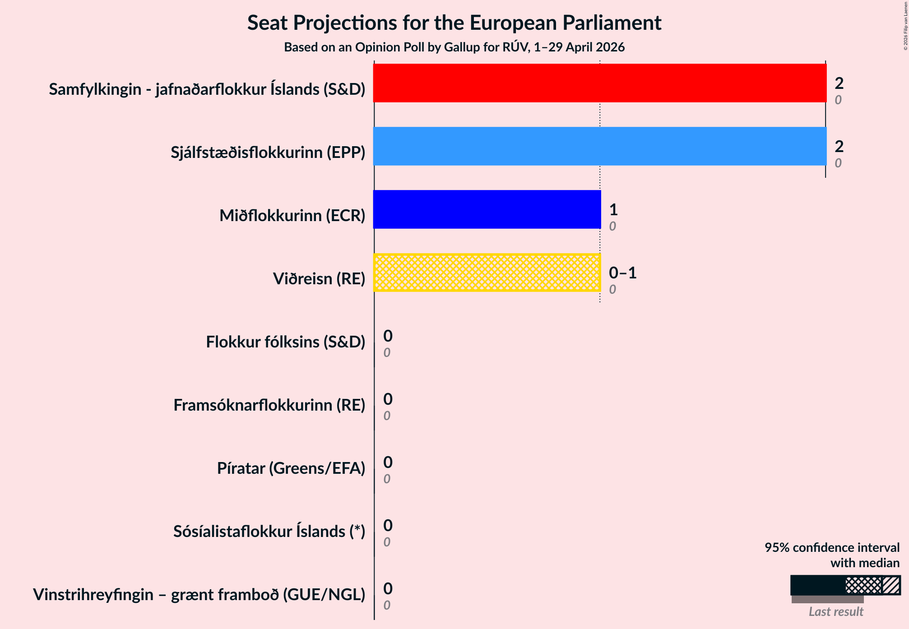

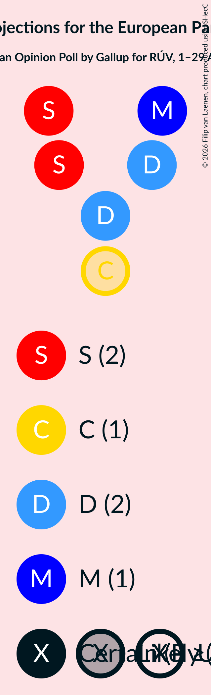

### Confidence Intervals

| Party | Last Result | Median | 80% Confidence Interval | 90% Confidence Interval | 95% Confidence Interval | 99% Confidence Interval |
|:-----:|:-----------:|:------:|:-----------------------:|:-----------------------:|:-----------------------:|:-----------------------:|
| <a href="#samfylkingin---jafnaðarflokkur-íslands-(s&d)">Samfylkingin - jafnaðarflokkur Íslands (S&D)</a> | 0 | 2 | 2 |2 |2 |2–3 |
| <a href="#sjálfstæðisflokkurinn-(epp)">Sjálfstæðisflokkurinn (EPP)</a> | 0 | 2 | 2 |2 |2 |2 |
| <a href="#miðflokkurinn-(ecr)">Miðflokkurinn (ECR)</a> | 0 | 1 | 1 |1 |1 |1–2 |
| <a href="#viðreisn-(re)">Viðreisn (RE)</a> | 0 | 1 | 1 |1 |0–1 |0–1 |
| <a href="#framsóknarflokkurinn-(re)">Framsóknarflokkurinn (RE)</a> | 0 | 0 | 0 |0 |0 |0 |
| <a href="#flokkur-fólksins-(s&d)">Flokkur fólksins (S&D)</a> | 0 | 0 | 0 |0 |0 |0 |
| <a href="#vinstrihreyfingin-–-grænt-framboð-(gue/ngl)">Vinstrihreyfingin – grænt framboð (GUE/NGL)</a> | 0 | 0 | 0 |0 |0 |0 |
| <a href="#sósíalistaflokkur-íslands-(*)">Sósíalistaflokkur Íslands (*)</a> | 0 | 0 | 0 |0 |0 |0 |
| <a href="#píratar-(greens/efa)">Píratar (Greens/EFA)</a> | 0 | 0 | 0 |0 |0 |0 |

### Samfylkingin - jafnaðarflokkur Íslands (S&D)

*For a full overview of the results for this party, see the [Samfylkingin - jafnaðarflokkur Íslands (S&D)](party-samfylkingin-jafnaðarflokkuríslandssd.html) page.*

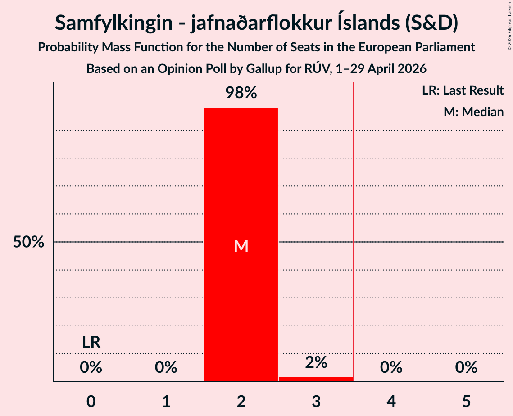

| Number of Seats | Probability | Accumulated | Special Marks |
|:---------------:|:-----------:|:-----------:|:-------------:|
| 0 | 0% | 100% | Last Result |
| 1 | 0% | 100% |  |
| 2 | 98% | 100% | Median |
| 3 | 2% | 2% |  |
| 4 | 0% | 0% | Majority |

### Sjálfstæðisflokkurinn (EPP)

*For a full overview of the results for this party, see the [Sjálfstæðisflokkurinn (EPP)](party-sjálfstæðisflokkurinnepp.html) page.*

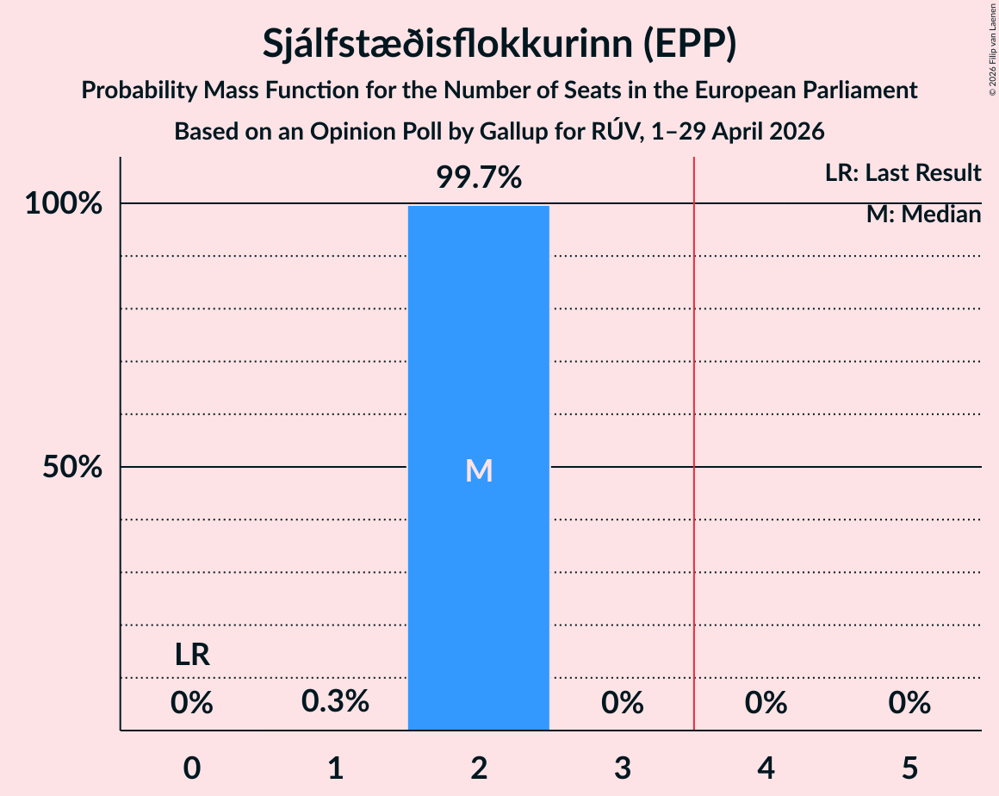

| Number of Seats | Probability | Accumulated | Special Marks |
|:---------------:|:-----------:|:-----------:|:-------------:|
| 0 | 0% | 100% | Last Result |
| 1 | 0.3% | 100% |  |
| 2 | 99.7% | 99.7% | Median |
| 3 | 0% | 0% |  |

### Miðflokkurinn (ECR)

*For a full overview of the results for this party, see the [Miðflokkurinn (ECR)](party-miðflokkurinnecr.html) page.*

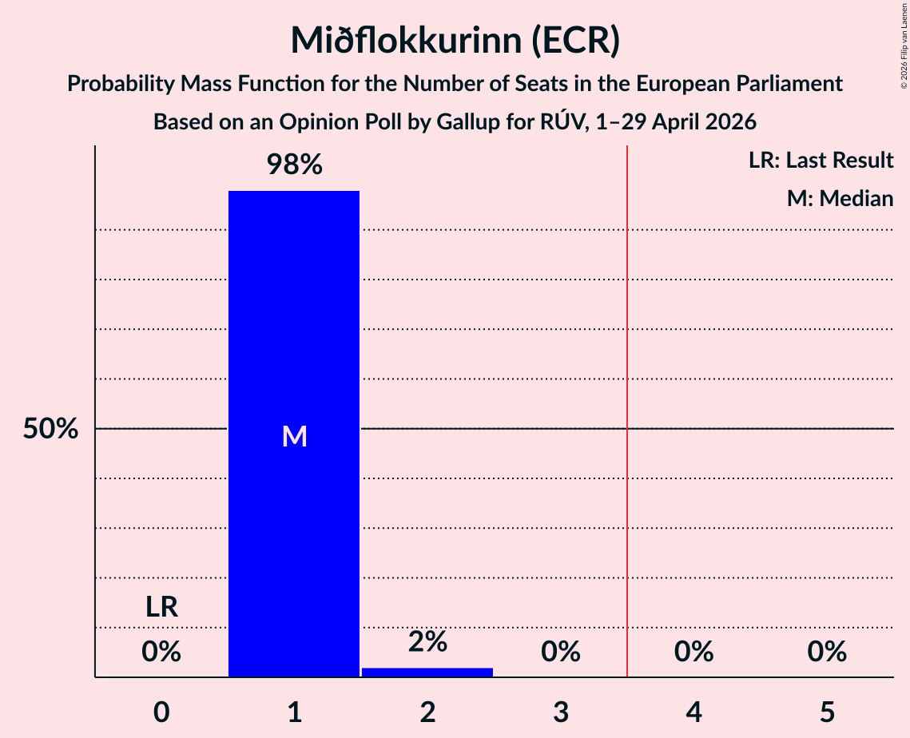

| Number of Seats | Probability | Accumulated | Special Marks |
|:---------------:|:-----------:|:-----------:|:-------------:|
| 0 | 0% | 100% | Last Result |
| 1 | 98% | 100% | Median |
| 2 | 2% | 2% |  |
| 3 | 0% | 0% |  |

### Viðreisn (RE)

*For a full overview of the results for this party, see the [Viðreisn (RE)](party-viðreisnre.html) page.*

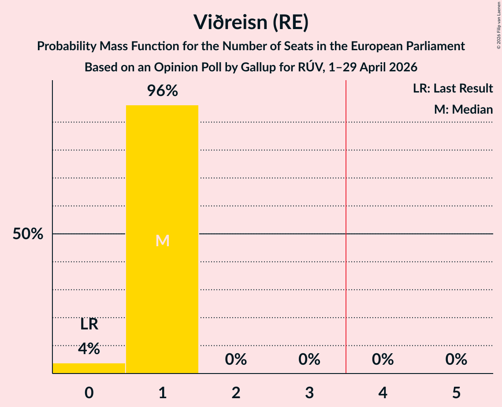

| Number of Seats | Probability | Accumulated | Special Marks |
|:---------------:|:-----------:|:-----------:|:-------------:|
| 0 | 3% | 100% | Last Result |
| 1 | 97% | 97% | Median |
| 2 | 0% | 0% |  |

### Framsóknarflokkurinn (RE)

*For a full overview of the results for this party, see the [Framsóknarflokkurinn (RE)](party-framsóknarflokkurinnre.html) page.*

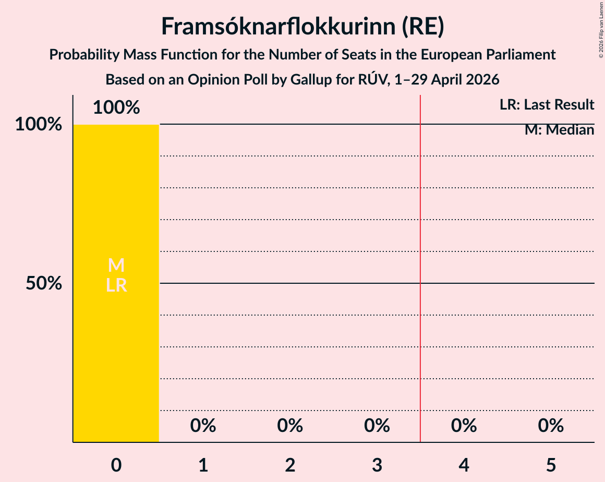

| Number of Seats | Probability | Accumulated | Special Marks |
|:---------------:|:-----------:|:-----------:|:-------------:|
| 0 | 100% | 100% | Last Result, Median |

### Flokkur fólksins (S&D)

*For a full overview of the results for this party, see the [Flokkur fólksins (S&D)](party-flokkurfólksinssd.html) page.*

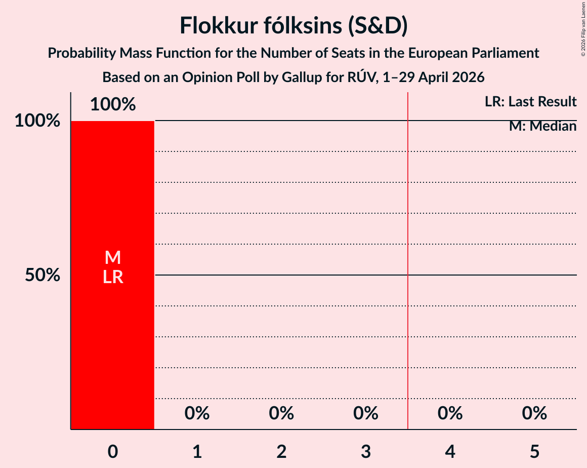

| Number of Seats | Probability | Accumulated | Special Marks |
|:---------------:|:-----------:|:-----------:|:-------------:|
| 0 | 100% | 100% | Last Result, Median |

### Vinstrihreyfingin – grænt framboð (GUE/NGL)

*For a full overview of the results for this party, see the [Vinstrihreyfingin – grænt framboð (GUE/NGL)](party-vinstrihreyfingin–græntframboðguengl.html) page.*

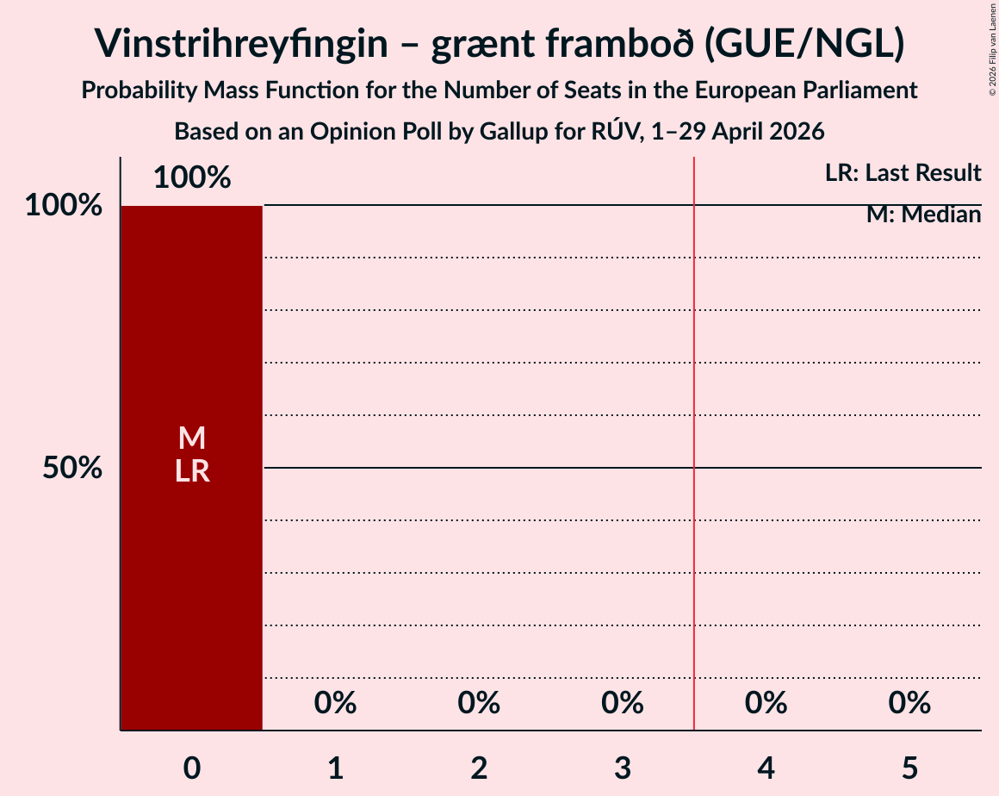

| Number of Seats | Probability | Accumulated | Special Marks |
|:---------------:|:-----------:|:-----------:|:-------------:|
| 0 | 100% | 100% | Last Result, Median |

### Sósíalistaflokkur Íslands (*)

*For a full overview of the results for this party, see the [Sósíalistaflokkur Íslands (*)](party-sósíalistaflokkuríslands.html) page.*

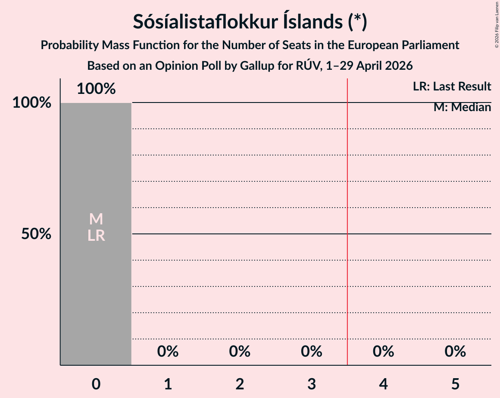

| Number of Seats | Probability | Accumulated | Special Marks |
|:---------------:|:-----------:|:-----------:|:-------------:|
| 0 | 100% | 100% | Last Result, Median |

### Píratar (Greens/EFA)

*For a full overview of the results for this party, see the [Píratar (Greens/EFA)](party-píratargreensefa.html) page.*

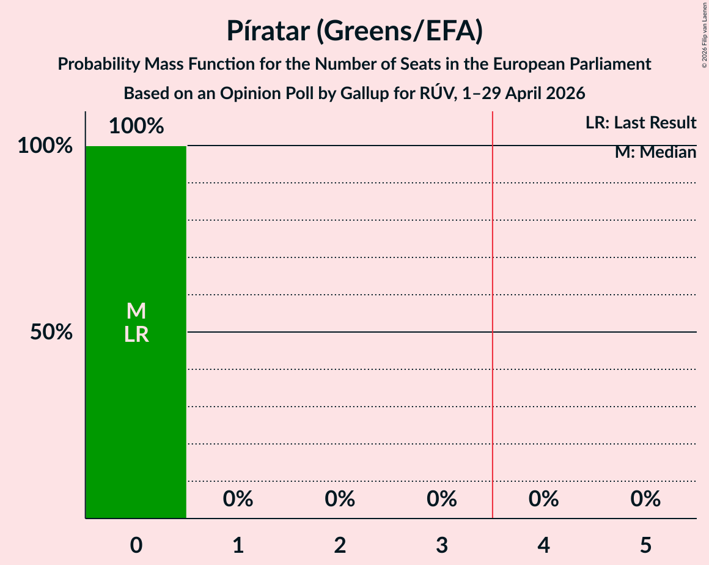

| Number of Seats | Probability | Accumulated | Special Marks |
|:---------------:|:-----------:|:-----------:|:-------------:|
| 0 | 100% | 100% | Last Result, Median |

## Coalitions

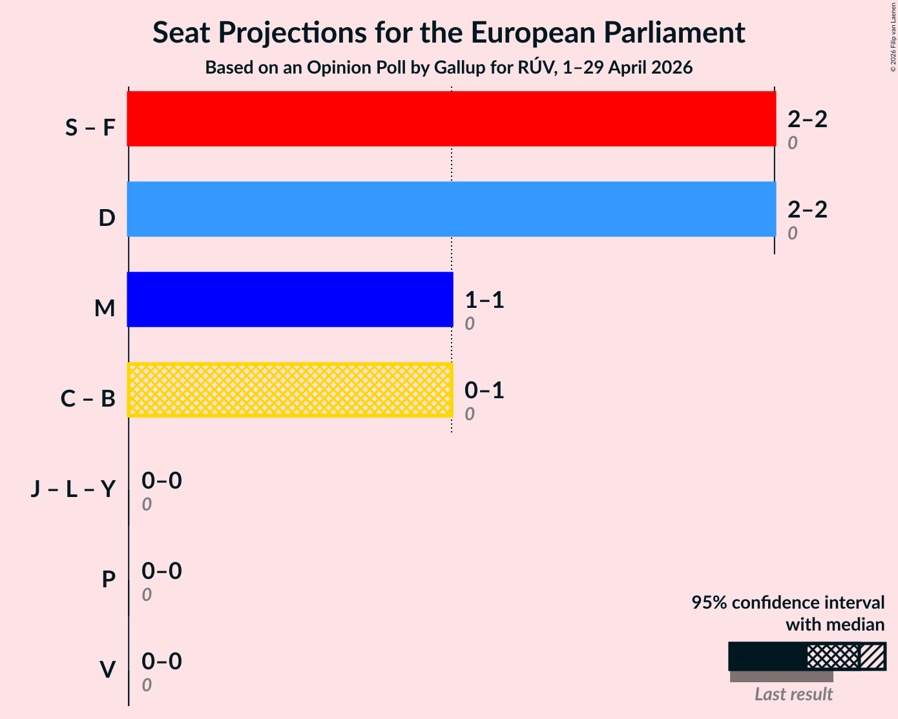

### Confidence Intervals

| Coalition | Last Result | Median | Majority? | 80% Confidence Interval | 90% Confidence Interval | 95% Confidence Interval | 99% Confidence Interval |
|:---------:|:-----------:|:------:|:---------:|:-----------------------:|:-----------------------:|:-----------------------:|:-----------------------:|
| Samfylkingin - jafnaðarflokkur Íslands (S&D) – Flokkur fólksins (S&D) | 0 | 2 | 0% | 2 | 2 | 2 | 2–3 |
| Sjálfstæðisflokkurinn (EPP) | 0 | 2 | 0% | 2 | 2 | 2 | 2 |
| Miðflokkurinn (ECR) | 0 | 1 | 0% | 1 | 1 | 1 | 1–2 |
| Viðreisn (RE) – Framsóknarflokkurinn (RE) | 0 | 1 | 0% | 1 | 1 | 0–1 | 0–1 |
| Píratar (Greens/EFA) | 0 | 0 | 0% | 0 | 0 | 0 | 0 |
| Vinstrihreyfingin – grænt framboð (GUE/NGL) | 0 | 0 | 0% | 0 | 0 | 0 | 0 |

### Samfylkingin - jafnaðarflokkur Íslands (S&D) – Flokkur fólksins (S&D)

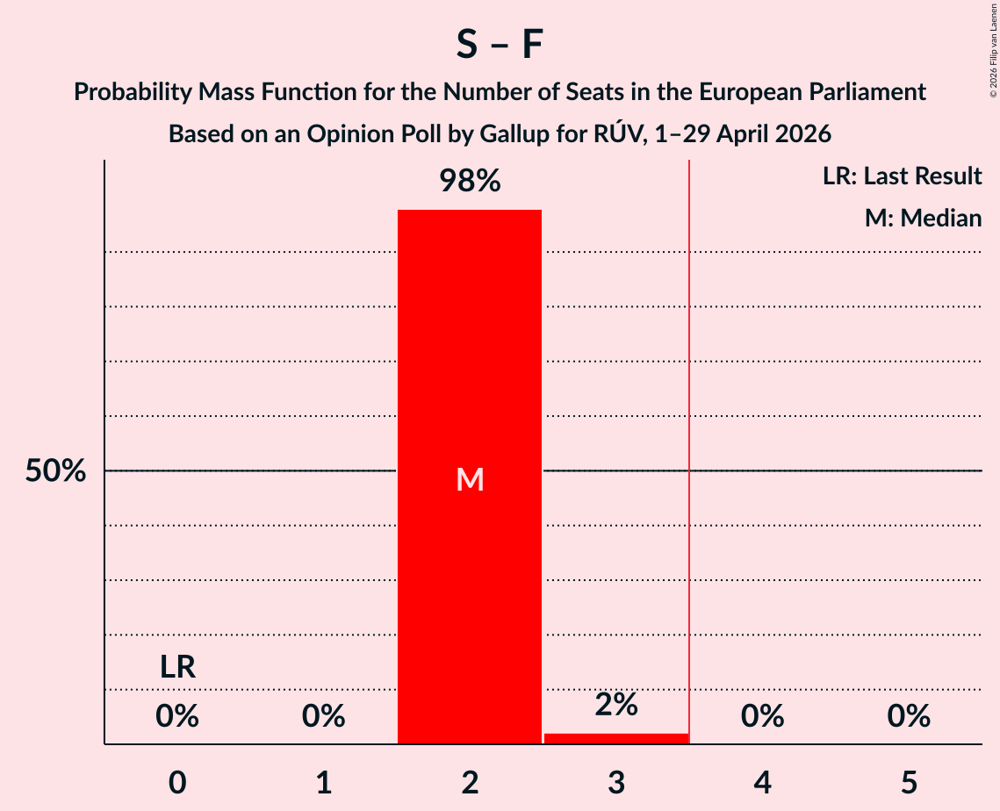

| Number of Seats | Probability | Accumulated | Special Marks |
|:---------------:|:-----------:|:-----------:|:-------------:|
| 0 | 0% | 100% | Last Result |
| 1 | 0% | 100% |  |
| 2 | 98% | 100% | Median |
| 3 | 2% | 2% |  |
| 4 | 0% | 0% | Majority |

### Sjálfstæðisflokkurinn (EPP)

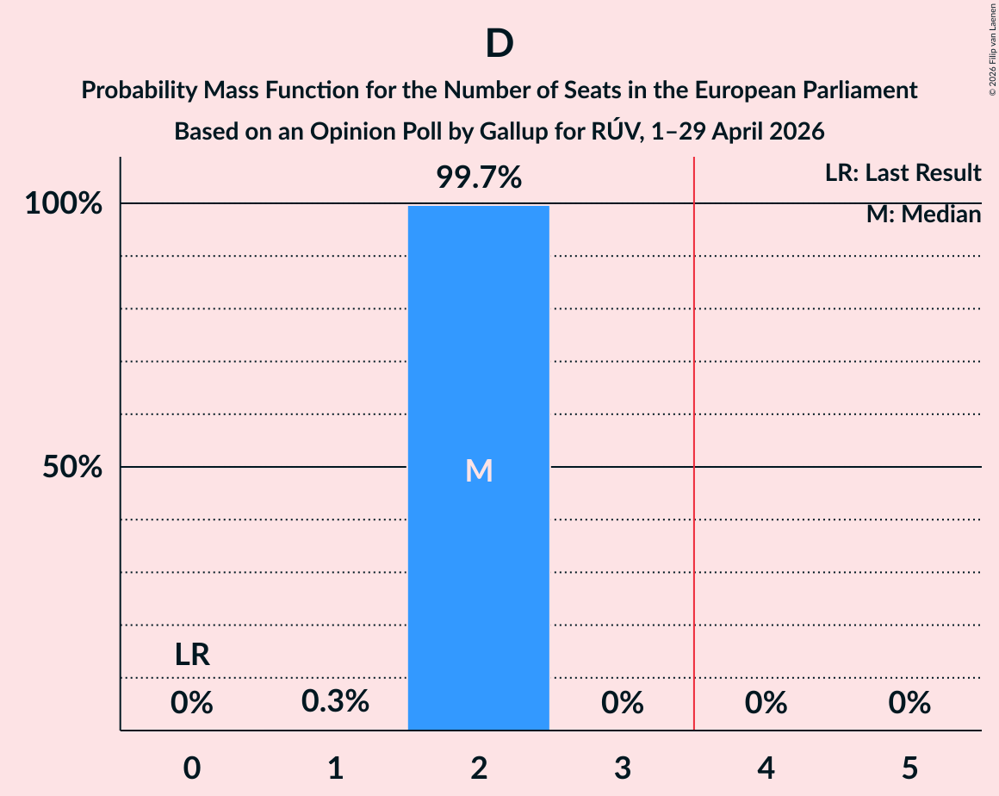

| Number of Seats | Probability | Accumulated | Special Marks |
|:---------------:|:-----------:|:-----------:|:-------------:|
| 0 | 0% | 100% | Last Result |
| 1 | 0.3% | 100% |  |
| 2 | 99.7% | 99.7% | Median |
| 3 | 0% | 0% |  |

### Miðflokkurinn (ECR)

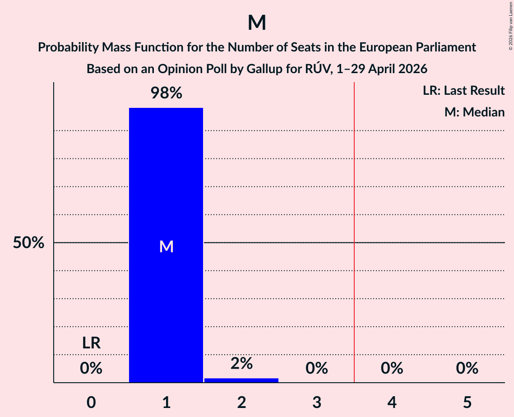

| Number of Seats | Probability | Accumulated | Special Marks |
|:---------------:|:-----------:|:-----------:|:-------------:|
| 0 | 0% | 100% | Last Result |
| 1 | 98% | 100% | Median |
| 2 | 2% | 2% |  |
| 3 | 0% | 0% |  |

### Viðreisn (RE) – Framsóknarflokkurinn (RE)

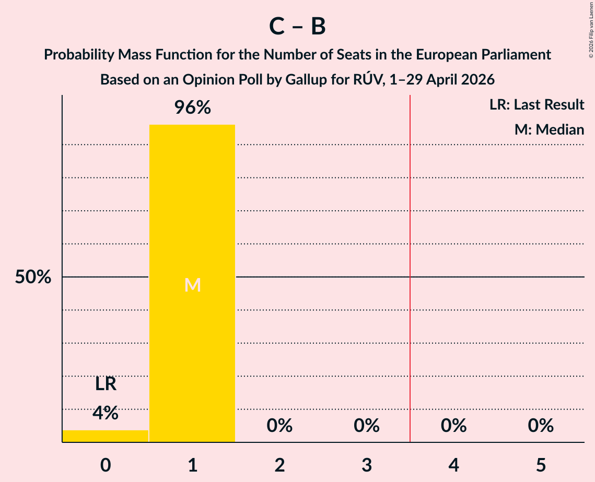

| Number of Seats | Probability | Accumulated | Special Marks |
|:---------------:|:-----------:|:-----------:|:-------------:|
| 0 | 3% | 100% | Last Result |
| 1 | 97% | 97% | Median |
| 2 | 0% | 0% |  |

### Píratar (Greens/EFA)

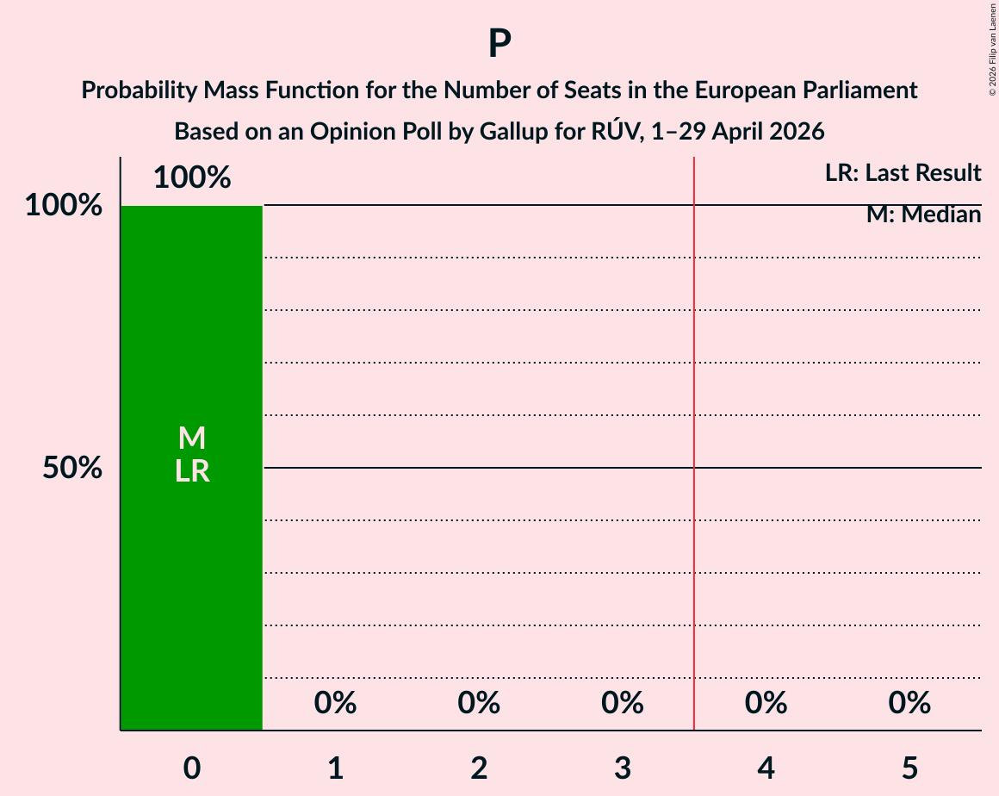

| Number of Seats | Probability | Accumulated | Special Marks |
|:---------------:|:-----------:|:-----------:|:-------------:|
| 0 | 100% | 100% | Last Result, Median |

### Vinstrihreyfingin – grænt framboð (GUE/NGL)

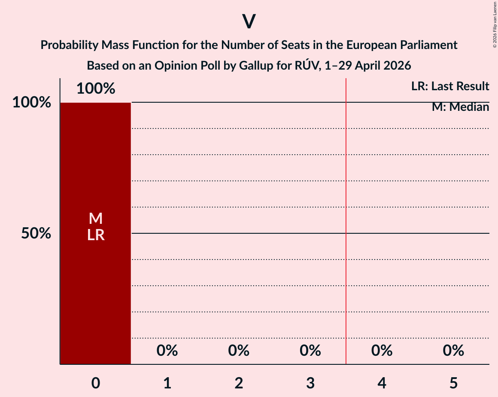

| Number of Seats | Probability | Accumulated | Special Marks |
|:---------------:|:-----------:|:-----------:|:-------------:|
| 0 | 100% | 100% | Last Result, Median |

## Technical Information

### Opinion Poll

+ **Polling firm:** Gallup
+ **Commissioner(s):** RÚV
+ **Fieldwork period:** 1–29 April 2026

### Calculations

+ **Sample size:** 4546
+ **Simulations done:** 2,097,152
+ **Error estimate:** 0.70%

