# Opinion Poll by Maskína for Vísir, 2–11 June 2026

<a href="#voting-intentions">Voting Intentions</a> | <a href="#seats">Seats</a> | <a href="#coalitions">Coalitions</a> | <a href="#technical-information">Technical Information</a>

## Voting Intentions

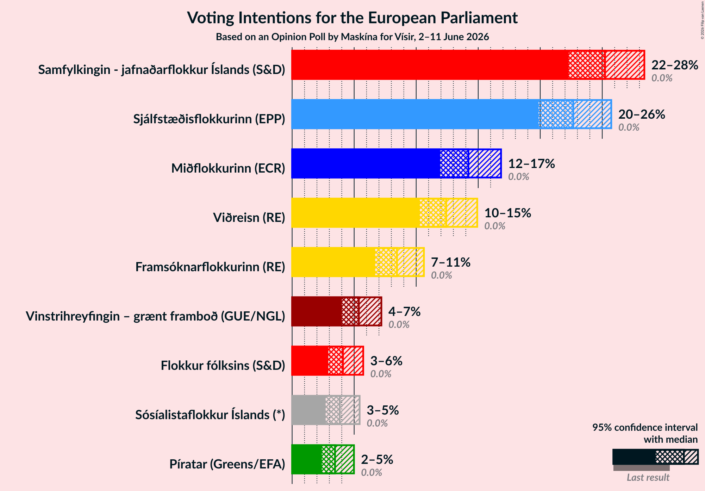

### Confidence Intervals

| Party | Last Result | Poll Result | 80% Confidence Interval | 90% Confidence Interval | 95% Confidence Interval | 99% Confidence Interval |
|:-----:|:-----------:|:-----------:|:-----------------------:|:-----------------------:|:-----------------------:|:-----------------------:|
| Samfylkingin - jafnaðarflokkur Íslands (S&D) | 0.0% | 25.2% | 23.3–27.3% |22.8–27.9% |22.3–28.4% |21.4–29.4% |
| Sjálfstæðisflokkurinn (EPP) | 0.0% | 22.7% | 20.8–24.7% |20.3–25.2% |19.9–25.7% |19.0–26.7% |
| Miðflokkurinn (ECR) | 0.0% | 14.2% | 12.7–15.9% |12.3–16.4% |11.9–16.8% |11.2–17.7% |
| Viðreisn (RE) | 0.0% | 12.4% | 11.0–14.1% |10.6–14.5% |10.3–14.9% |9.6–15.7% |
| Framsóknarflokkurinn (RE) | 0.0% | 8.5% | 7.3–9.9% |7.0–10.3% |6.7–10.6% |6.2–11.3% |
| Vinstrihreyfingin – grænt framboð (GUE/NGL) | 0.0% | 5.4% | 4.5–6.6% |4.2–6.9% |4.0–7.2% |3.6–7.8% |
| Flokkur fólksins (S&D) | 0.0% | 4.1% | 3.3–5.2% |3.1–5.5% |2.9–5.7% |2.6–6.3% |
| Sósíalistaflokkur Íslands (*) | 0.0% | 3.8% | 3.1–4.9% |2.9–5.2% |2.7–5.4% |2.4–6.0% |
| Píratar (Greens/EFA) | 0.0% | 3.5% | 2.7–4.5% |2.5–4.7% |2.4–5.0% |2.1–5.5% |

*Note:* The poll result column reflects the actual value used in the calculations. Published results may vary slightly, and in addition be rounded to fewer digits.

## Seats

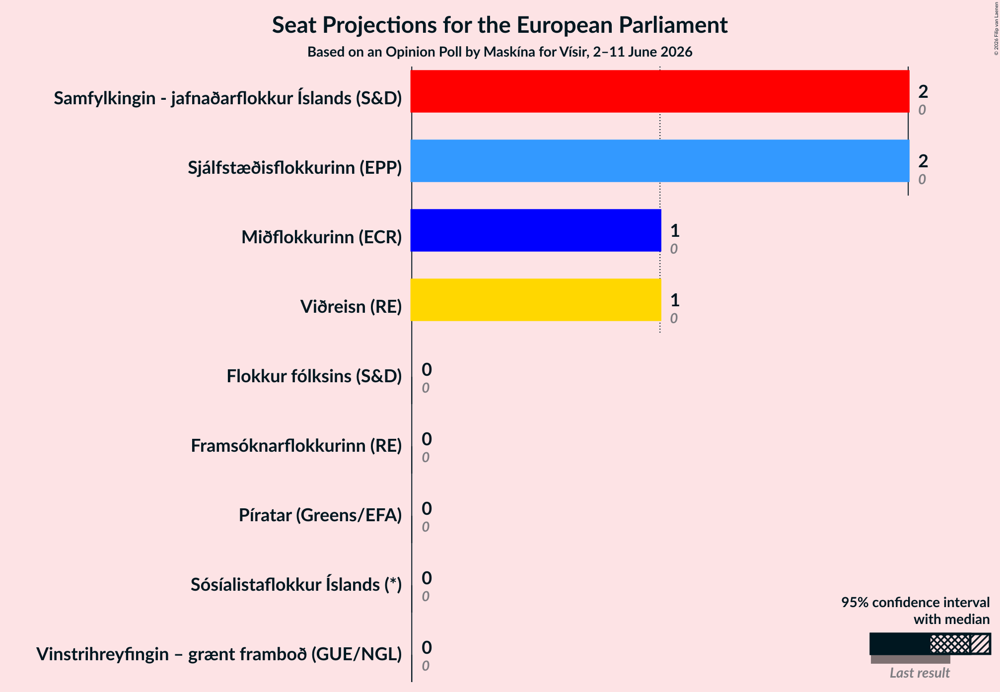

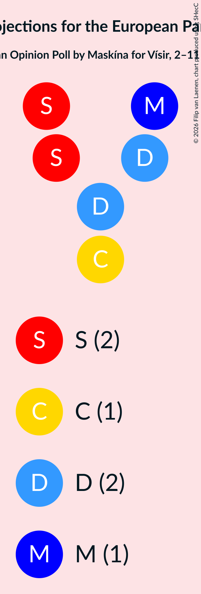

### Confidence Intervals

| Party | Last Result | Median | 80% Confidence Interval | 90% Confidence Interval | 95% Confidence Interval | 99% Confidence Interval |
|:-----:|:-----------:|:------:|:-----------------------:|:-----------------------:|:-----------------------:|:-----------------------:|
| <a href="#samfylkingin---jafnaðarflokkur-íslands-(s&d)">Samfylkingin - jafnaðarflokkur Íslands (S&D)</a> | 0 | 2 | 2 |2 |2 |2 |
| <a href="#sjálfstæðisflokkurinn-(epp)">Sjálfstæðisflokkurinn (EPP)</a> | 0 | 2 | 2 |2 |2 |1–2 |
| <a href="#miðflokkurinn-(ecr)">Miðflokkurinn (ECR)</a> | 0 | 1 | 1 |1 |1 |1 |
| <a href="#viðreisn-(re)">Viðreisn (RE)</a> | 0 | 1 | 1 |1 |1 |1 |
| <a href="#framsóknarflokkurinn-(re)">Framsóknarflokkurinn (RE)</a> | 0 | 0 | 0 |0 |0 |0–1 |
| <a href="#vinstrihreyfingin-–-grænt-framboð-(gue/ngl)">Vinstrihreyfingin – grænt framboð (GUE/NGL)</a> | 0 | 0 | 0 |0 |0 |0 |
| <a href="#flokkur-fólksins-(s&d)">Flokkur fólksins (S&D)</a> | 0 | 0 | 0 |0 |0 |0 |
| <a href="#sósíalistaflokkur-íslands-(*)">Sósíalistaflokkur Íslands (*)</a> | 0 | 0 | 0 |0 |0 |0 |
| <a href="#píratar-(greens/efa)">Píratar (Greens/EFA)</a> | 0 | 0 | 0 |0 |0 |0 |

### Samfylkingin - jafnaðarflokkur Íslands (S&D)

*For a full overview of the results for this party, see the [Samfylkingin - jafnaðarflokkur Íslands (S&D)](party-samfylkingin-jafnaðarflokkuríslandssd.html) page.*

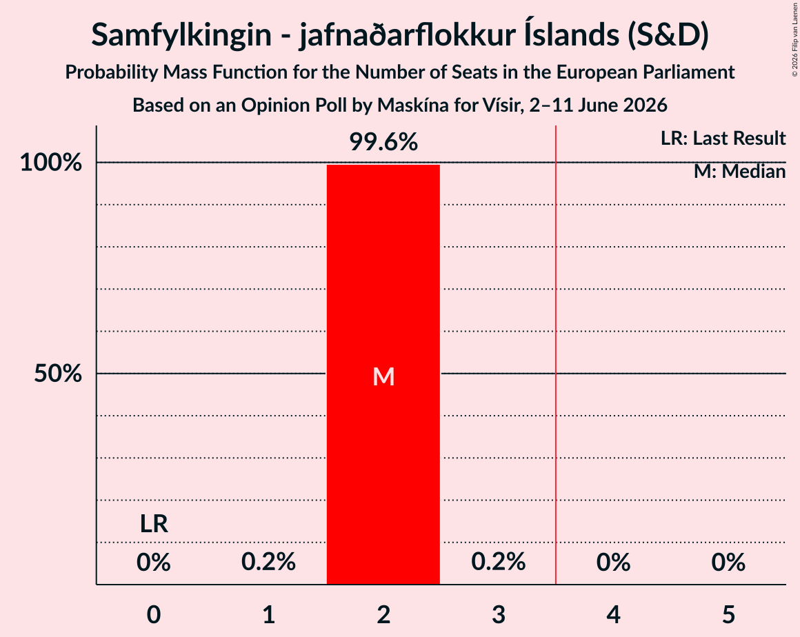

| Number of Seats | Probability | Accumulated | Special Marks |
|:---------------:|:-----------:|:-----------:|:-------------:|
| 0 | 0% | 100% | Last Result |
| 1 | 0.2% | 100% |  |
| 2 | 99.6% | 99.8% | Median |
| 3 | 0.2% | 0.2% |  |
| 4 | 0% | 0% | Majority |

### Sjálfstæðisflokkurinn (EPP)

*For a full overview of the results for this party, see the [Sjálfstæðisflokkurinn (EPP)](party-sjálfstæðisflokkurinnepp.html) page.*

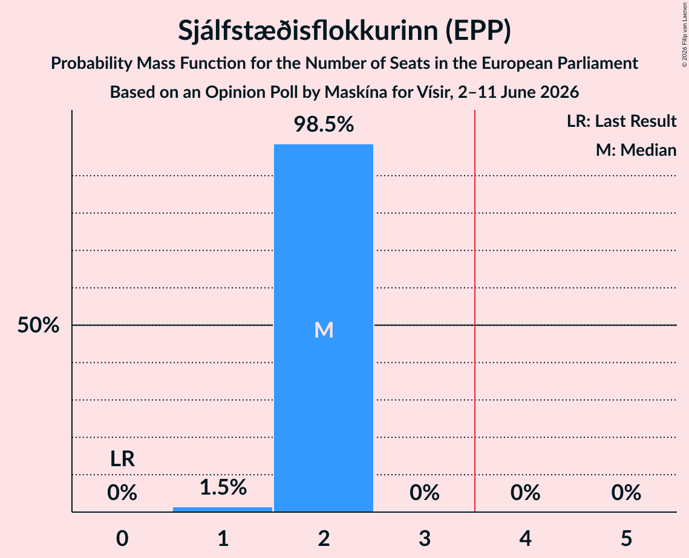

| Number of Seats | Probability | Accumulated | Special Marks |
|:---------------:|:-----------:|:-----------:|:-------------:|
| 0 | 0% | 100% | Last Result |
| 1 | 2% | 100% |  |
| 2 | 98% | 98% | Median |
| 3 | 0% | 0% |  |

### Miðflokkurinn (ECR)

*For a full overview of the results for this party, see the [Miðflokkurinn (ECR)](party-miðflokkurinnecr.html) page.*

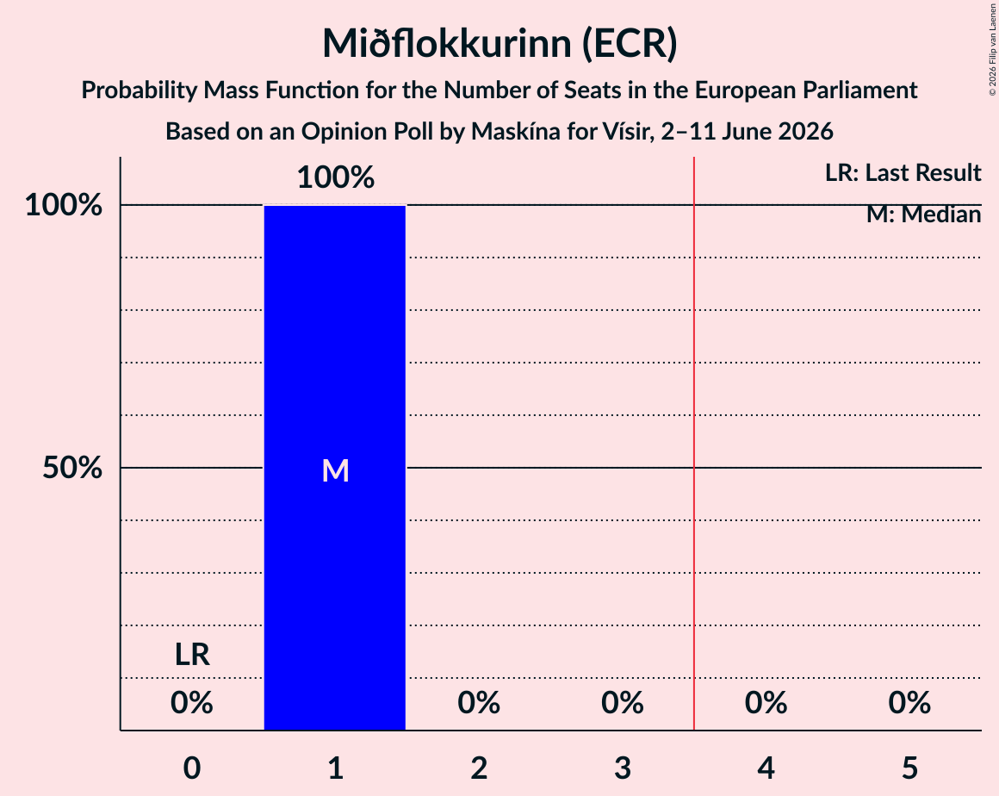

| Number of Seats | Probability | Accumulated | Special Marks |
|:---------------:|:-----------:|:-----------:|:-------------:|
| 0 | 0% | 100% | Last Result |
| 1 | 100% | 100% | Median |

### Viðreisn (RE)

*For a full overview of the results for this party, see the [Viðreisn (RE)](party-viðreisnre.html) page.*

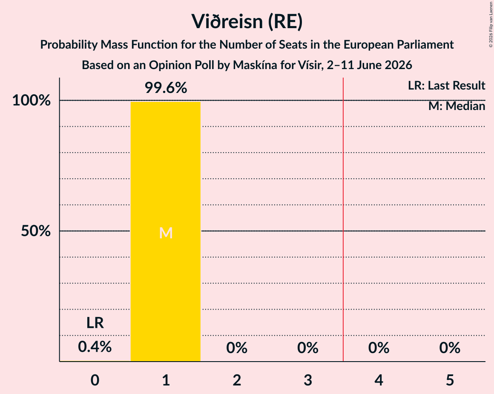

| Number of Seats | Probability | Accumulated | Special Marks |
|:---------------:|:-----------:|:-----------:|:-------------:|
| 0 | 0.4% | 100% | Last Result |
| 1 | 99.6% | 99.6% | Median |
| 2 | 0% | 0% |  |

### Framsóknarflokkurinn (RE)

*For a full overview of the results for this party, see the [Framsóknarflokkurinn (RE)](party-framsóknarflokkurinnre.html) page.*

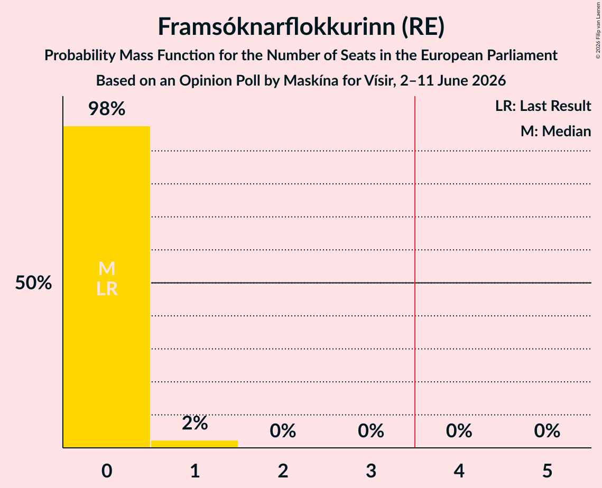

| Number of Seats | Probability | Accumulated | Special Marks |
|:---------------:|:-----------:|:-----------:|:-------------:|
| 0 | 98% | 100% | Last Result, Median |
| 1 | 2% | 2% |  |
| 2 | 0% | 0% |  |

### Vinstrihreyfingin – grænt framboð (GUE/NGL)

*For a full overview of the results for this party, see the [Vinstrihreyfingin – grænt framboð (GUE/NGL)](party-vinstrihreyfingin–græntframboðguengl.html) page.*

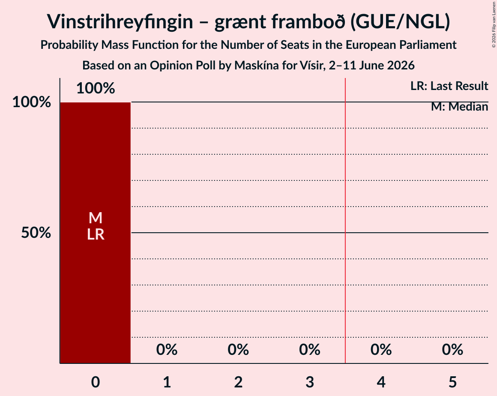

| Number of Seats | Probability | Accumulated | Special Marks |
|:---------------:|:-----------:|:-----------:|:-------------:|
| 0 | 100% | 100% | Last Result, Median |

### Flokkur fólksins (S&D)

*For a full overview of the results for this party, see the [Flokkur fólksins (S&D)](party-flokkurfólksinssd.html) page.*

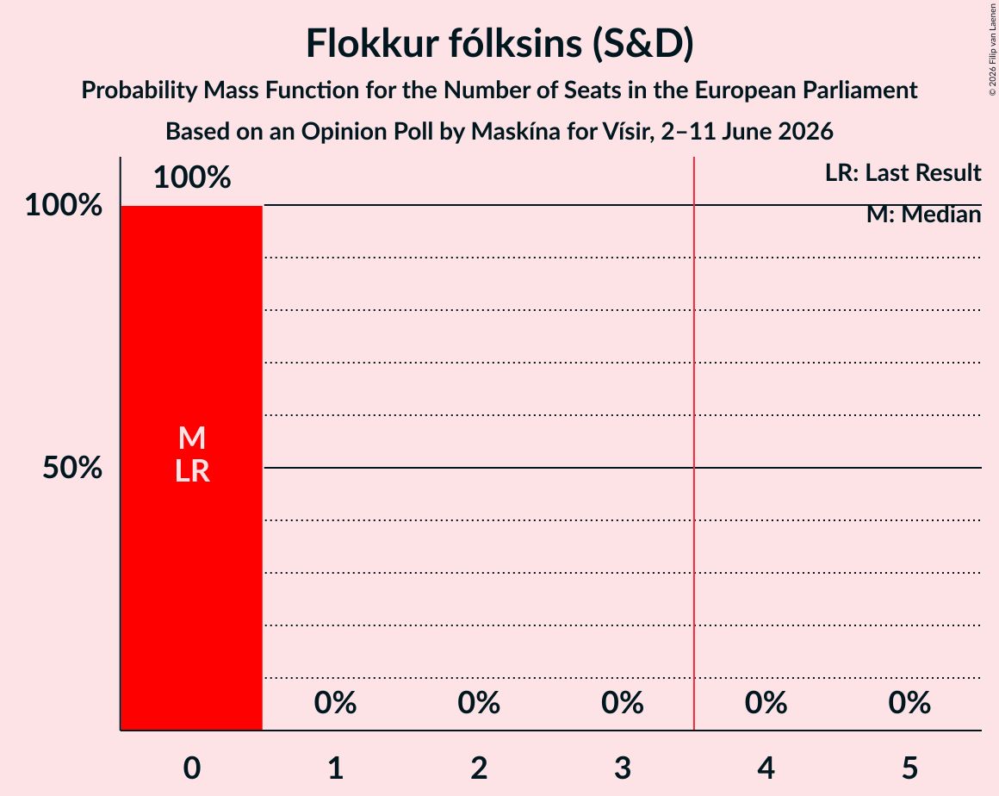

| Number of Seats | Probability | Accumulated | Special Marks |
|:---------------:|:-----------:|:-----------:|:-------------:|
| 0 | 100% | 100% | Last Result, Median |

### Sósíalistaflokkur Íslands (*)

*For a full overview of the results for this party, see the [Sósíalistaflokkur Íslands (*)](party-sósíalistaflokkuríslands.html) page.*

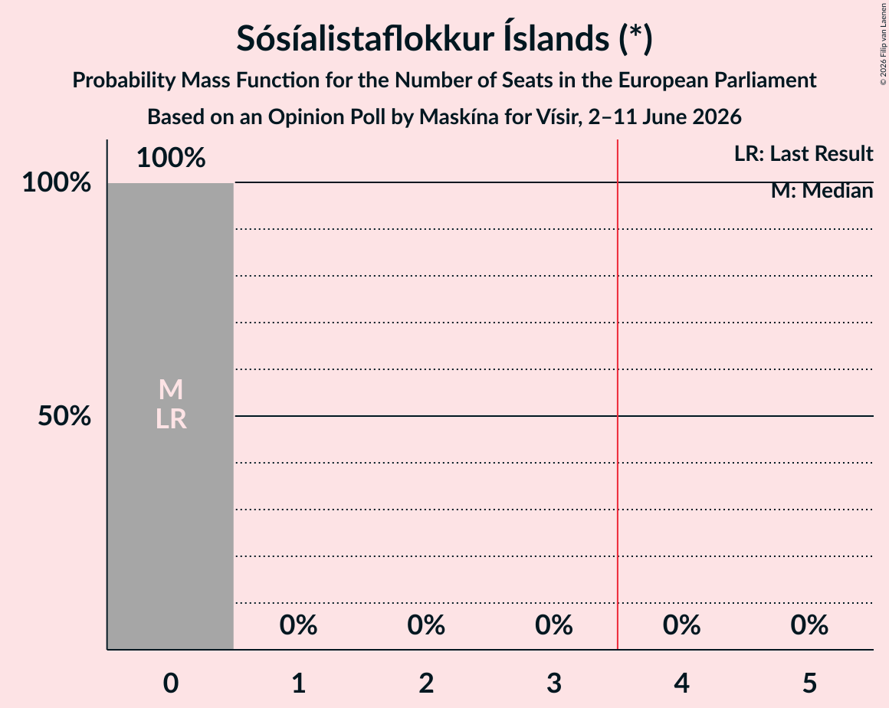

| Number of Seats | Probability | Accumulated | Special Marks |
|:---------------:|:-----------:|:-----------:|:-------------:|
| 0 | 100% | 100% | Last Result, Median |

### Píratar (Greens/EFA)

*For a full overview of the results for this party, see the [Píratar (Greens/EFA)](party-píratargreensefa.html) page.*

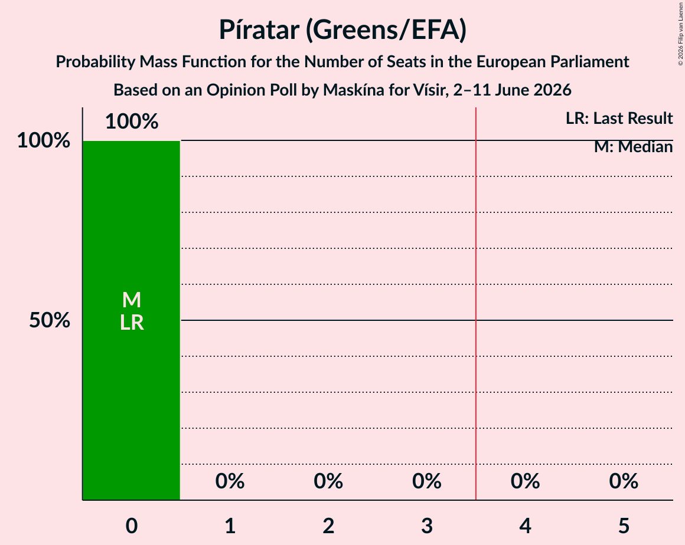

| Number of Seats | Probability | Accumulated | Special Marks |
|:---------------:|:-----------:|:-----------:|:-------------:|
| 0 | 100% | 100% | Last Result, Median |

## Coalitions

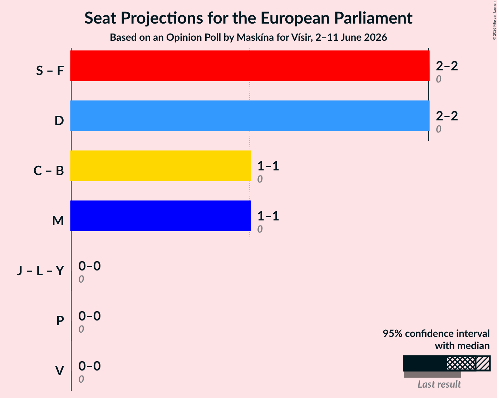

### Confidence Intervals

| Coalition | Last Result | Median | Majority? | 80% Confidence Interval | 90% Confidence Interval | 95% Confidence Interval | 99% Confidence Interval |
|:---------:|:-----------:|:------:|:---------:|:-----------------------:|:-----------------------:|:-----------------------:|:-----------------------:|
| Samfylkingin - jafnaðarflokkur Íslands (S&D) – Flokkur fólksins (S&D) | 0 | 2 | 0% | 2 | 2 | 2 | 2 |
| Sjálfstæðisflokkurinn (EPP) | 0 | 2 | 0% | 2 | 2 | 2 | 1–2 |
| Viðreisn (RE) – Framsóknarflokkurinn (RE) | 0 | 1 | 0% | 1 | 1 | 1 | 1–2 |
| Miðflokkurinn (ECR) | 0 | 1 | 0% | 1 | 1 | 1 | 1 |
| Píratar (Greens/EFA) | 0 | 0 | 0% | 0 | 0 | 0 | 0 |
| Vinstrihreyfingin – grænt framboð (GUE/NGL) | 0 | 0 | 0% | 0 | 0 | 0 | 0 |

### Samfylkingin - jafnaðarflokkur Íslands (S&D) – Flokkur fólksins (S&D)

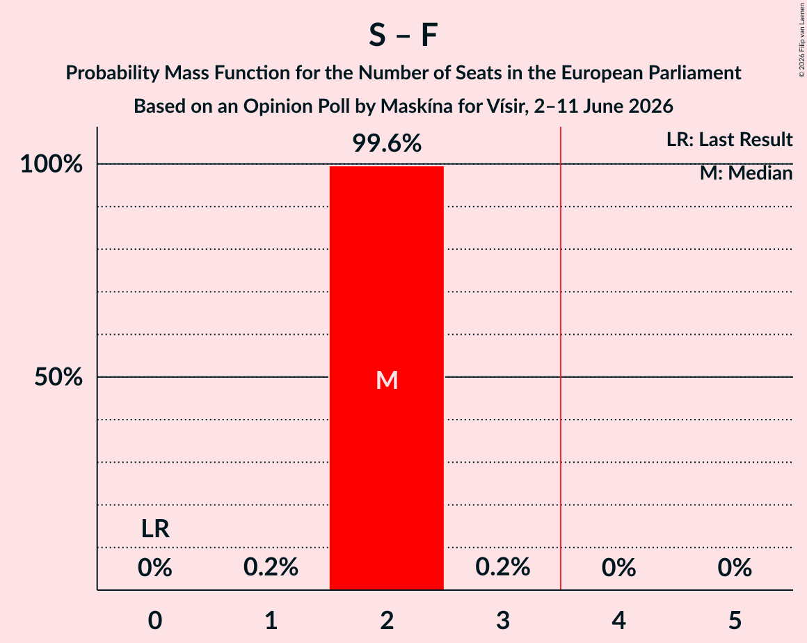

| Number of Seats | Probability | Accumulated | Special Marks |
|:---------------:|:-----------:|:-----------:|:-------------:|
| 0 | 0% | 100% | Last Result |
| 1 | 0.2% | 100% |  |
| 2 | 99.6% | 99.8% | Median |
| 3 | 0.2% | 0.2% |  |
| 4 | 0% | 0% | Majority |

### Sjálfstæðisflokkurinn (EPP)

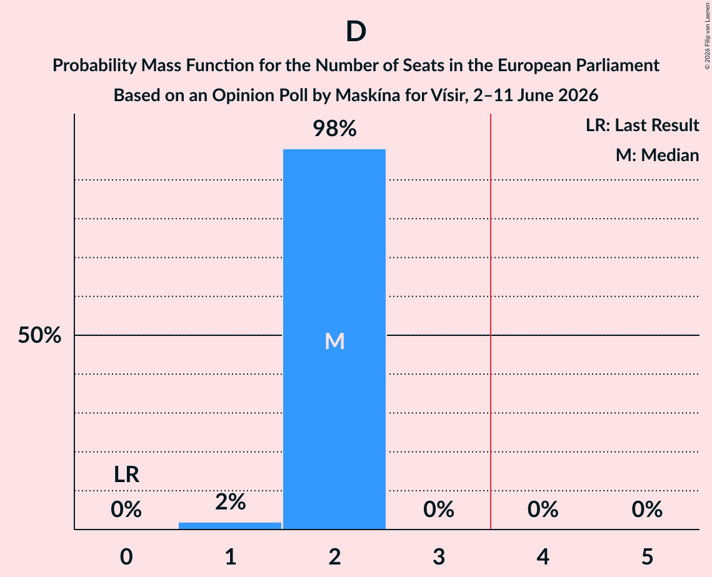

| Number of Seats | Probability | Accumulated | Special Marks |
|:---------------:|:-----------:|:-----------:|:-------------:|
| 0 | 0% | 100% | Last Result |
| 1 | 2% | 100% |  |
| 2 | 98% | 98% | Median |
| 3 | 0% | 0% |  |

### Viðreisn (RE) – Framsóknarflokkurinn (RE)

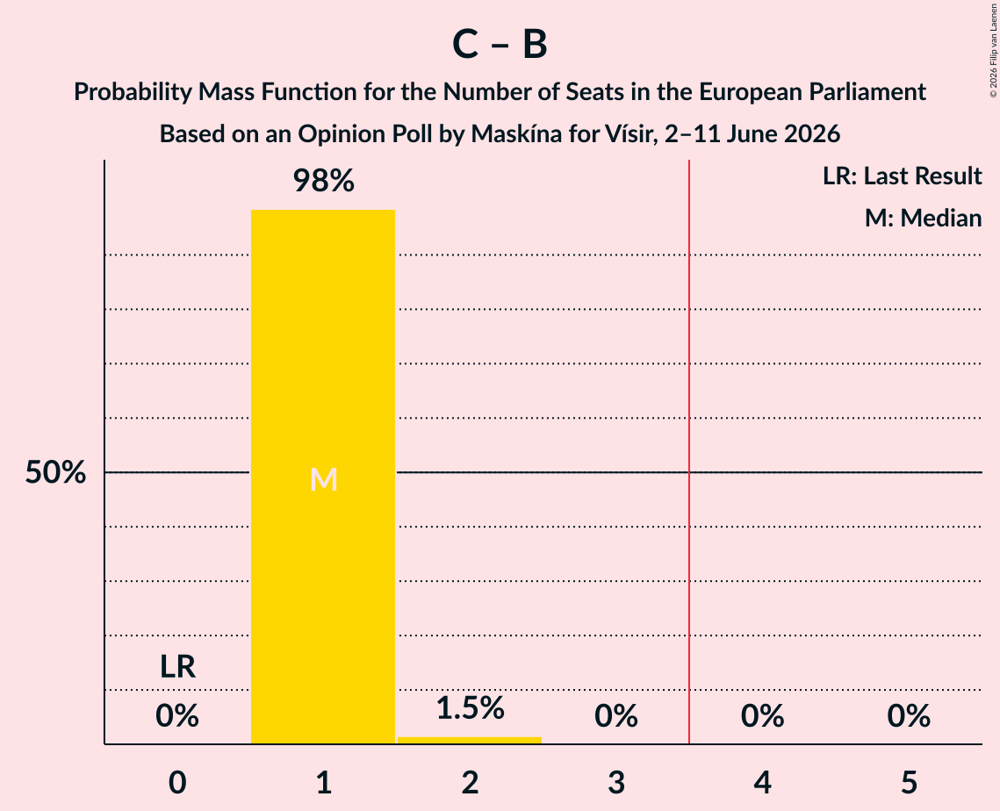

| Number of Seats | Probability | Accumulated | Special Marks |
|:---------------:|:-----------:|:-----------:|:-------------:|
| 0 | 0% | 100% | Last Result |
| 1 | 98% | 100% | Median |
| 2 | 2% | 2% |  |
| 3 | 0% | 0% |  |

### Miðflokkurinn (ECR)

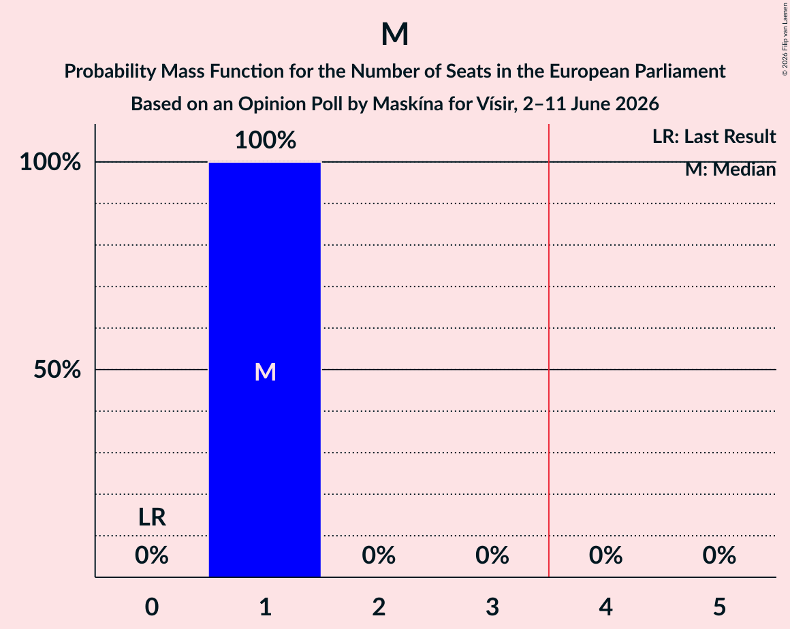

| Number of Seats | Probability | Accumulated | Special Marks |
|:---------------:|:-----------:|:-----------:|:-------------:|
| 0 | 0% | 100% | Last Result |
| 1 | 100% | 100% | Median |

### Píratar (Greens/EFA)

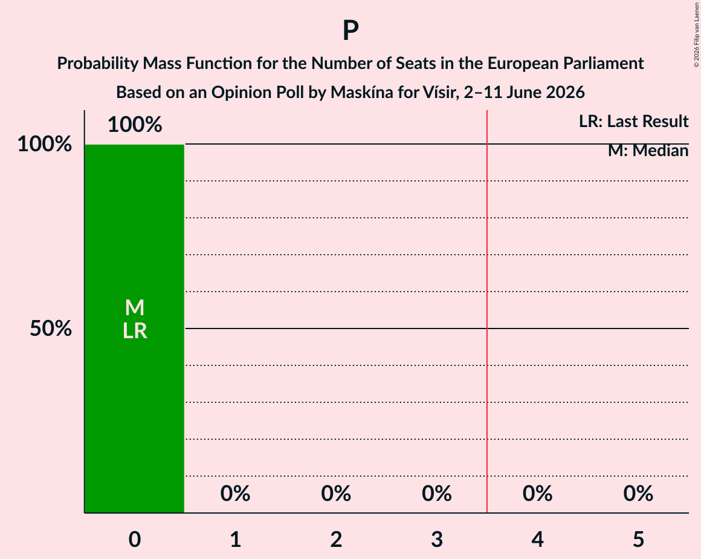

| Number of Seats | Probability | Accumulated | Special Marks |
|:---------------:|:-----------:|:-----------:|:-------------:|
| 0 | 100% | 100% | Last Result, Median |

### Vinstrihreyfingin – grænt framboð (GUE/NGL)

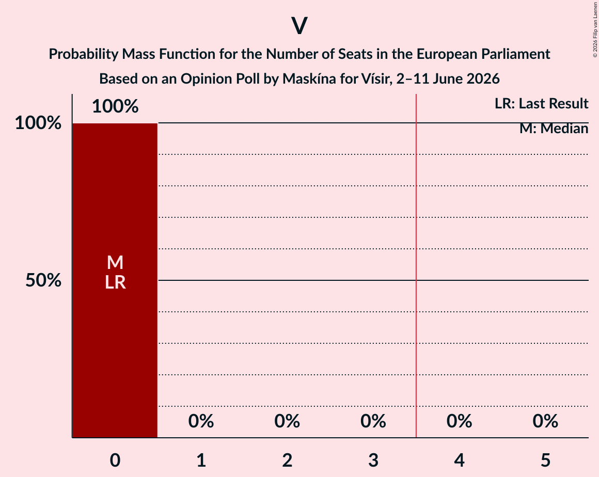

| Number of Seats | Probability | Accumulated | Special Marks |
|:---------------:|:-----------:|:-----------:|:-------------:|
| 0 | 100% | 100% | Last Result, Median |

## Technical Information

### Opinion Poll

+ **Polling firm:** Maskína
+ **Commissioner(s):** Vísir
+ **Fieldwork period:** 2–11 June 2026

### Calculations

+ **Sample size:** 781
+ **Simulations done:** 2,097,152
+ **Error estimate:** 1.98%

