# Opinion Poll by Maskína, 26 June–8 July 2026

<a href="#voting-intentions">Voting Intentions</a> | <a href="#seats">Seats</a> | <a href="#coalitions">Coalitions</a> | <a href="#technical-information">Technical Information</a>

## Voting Intentions

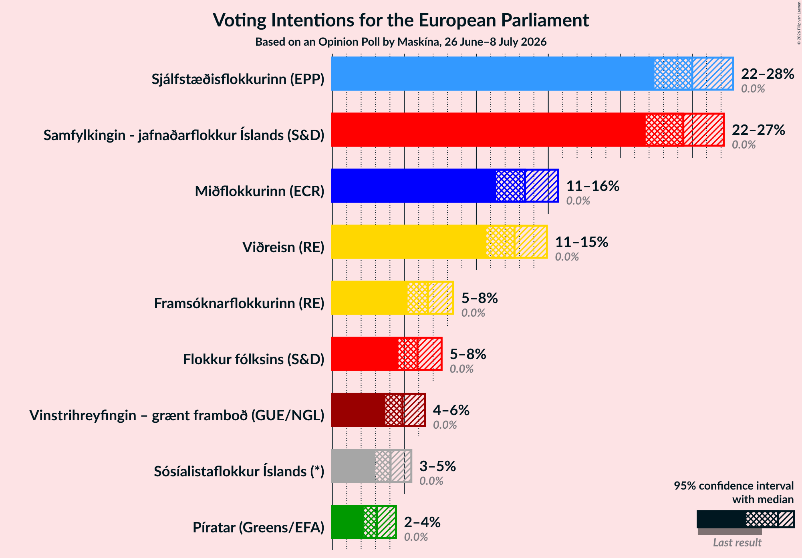

### Confidence Intervals

| Party | Last Result | Poll Result | 80% Confidence Interval | 90% Confidence Interval | 95% Confidence Interval | 99% Confidence Interval |
|:-----:|:-----------:|:-----------:|:-----------------------:|:-----------------------:|:-----------------------:|:-----------------------:|
| Sjálfstæðisflokkurinn (EPP) | 0.0% | 25.0% | 23.3–26.9% |22.8–27.4% |22.4–27.8% |21.6–28.7% |
| Samfylkingin - jafnaðarflokkur Íslands (S&D) | 0.0% | 24.4% | 22.7–26.2% |22.2–26.7% |21.8–27.2% |21.0–28.1% |
| Miðflokkurinn (ECR) | 0.0% | 13.4% | 12.1–14.9% |11.7–15.3% |11.4–15.7% |10.8–16.4% |
| Viðreisn (RE) | 0.0% | 12.7% | 11.4–14.1% |11.0–14.5% |10.7–14.9% |10.1–15.6% |
| Framsóknarflokkurinn (RE) | 0.0% | 6.6% | 5.7–7.8% |5.5–8.1% |5.2–8.4% |4.8–9.0% |
| Flokkur fólksins (S&D) | 0.0% | 5.9% | 5.0–7.0% |4.8–7.3% |4.6–7.6% |4.2–8.1% |
| Vinstrihreyfingin – grænt framboð (GUE/NGL) | 0.0% | 4.9% | 4.1–5.9% |3.9–6.2% |3.7–6.4% |3.3–6.9% |
| Sósíalistaflokkur Íslands (*) | 0.0% | 4.0% | 3.3–5.0% |3.1–5.2% |3.0–5.5% |2.7–6.0% |
| Píratar (Greens/EFA) | 0.0% | 3.1% | 2.5–4.0% |2.3–4.2% |2.2–4.4% |1.9–4.8% |

*Note:* The poll result column reflects the actual value used in the calculations. Published results may vary slightly, and in addition be rounded to fewer digits.

## Seats

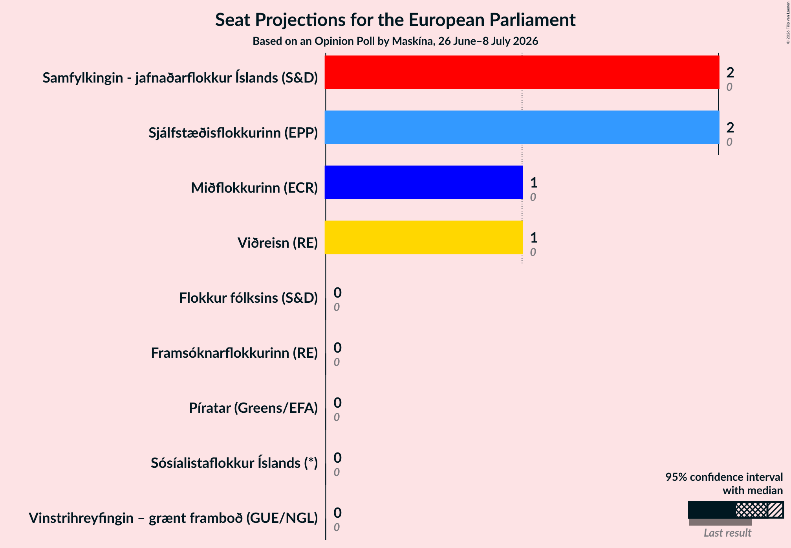

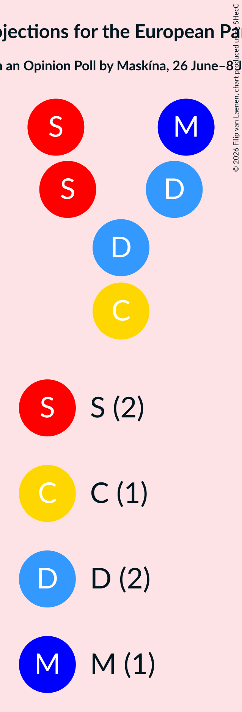

### Confidence Intervals

| Party | Last Result | Median | 80% Confidence Interval | 90% Confidence Interval | 95% Confidence Interval | 99% Confidence Interval |
|:-----:|:-----------:|:------:|:-----------------------:|:-----------------------:|:-----------------------:|:-----------------------:|
| <a href="#sjálfstæðisflokkurinn-(epp)">Sjálfstæðisflokkurinn (EPP)</a> | 0 | 2 | 2 |2 |2 |2 |
| <a href="#samfylkingin---jafnaðarflokkur-íslands-(s&d)">Samfylkingin - jafnaðarflokkur Íslands (S&D)</a> | 0 | 2 | 2 |2 |2 |2 |
| <a href="#miðflokkurinn-(ecr)">Miðflokkurinn (ECR)</a> | 0 | 1 | 1 |1 |1 |1 |
| <a href="#viðreisn-(re)">Viðreisn (RE)</a> | 0 | 1 | 1 |1 |1 |1 |
| <a href="#framsóknarflokkurinn-(re)">Framsóknarflokkurinn (RE)</a> | 0 | 0 | 0 |0 |0 |0 |
| <a href="#flokkur-fólksins-(s&d)">Flokkur fólksins (S&D)</a> | 0 | 0 | 0 |0 |0 |0 |
| <a href="#vinstrihreyfingin-–-grænt-framboð-(gue/ngl)">Vinstrihreyfingin – grænt framboð (GUE/NGL)</a> | 0 | 0 | 0 |0 |0 |0 |
| <a href="#sósíalistaflokkur-íslands-(*)">Sósíalistaflokkur Íslands (*)</a> | 0 | 0 | 0 |0 |0 |0 |
| <a href="#píratar-(greens/efa)">Píratar (Greens/EFA)</a> | 0 | 0 | 0 |0 |0 |0 |

### Sjálfstæðisflokkurinn (EPP)

*For a full overview of the results for this party, see the [Sjálfstæðisflokkurinn (EPP)](party-sjálfstæðisflokkurinnepp.html) page.*

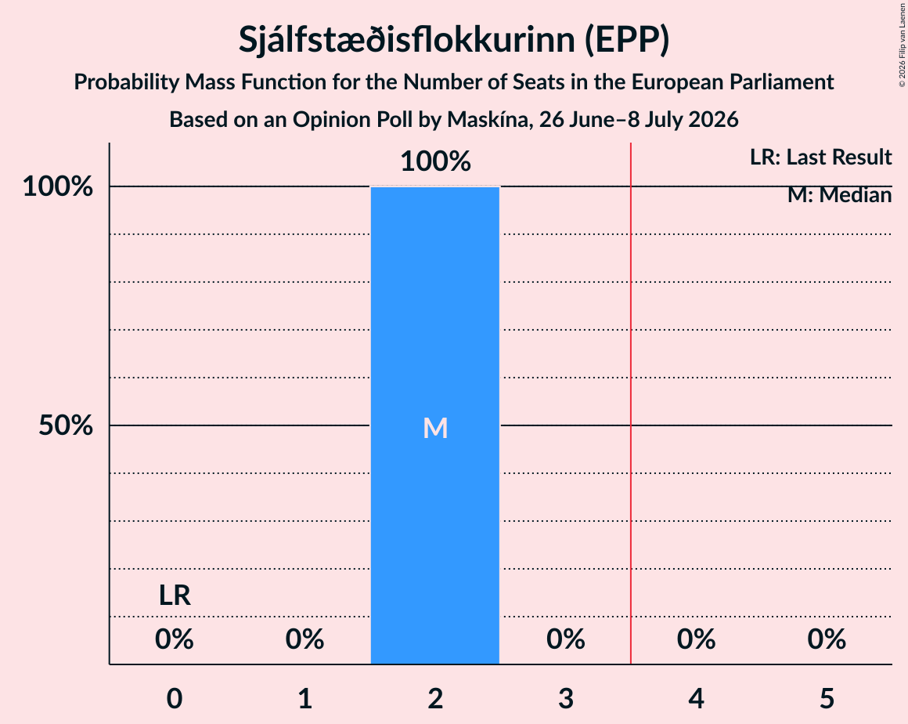

| Number of Seats | Probability | Accumulated | Special Marks |
|:---------------:|:-----------:|:-----------:|:-------------:|
| 0 | 0% | 100% | Last Result |
| 1 | 0% | 100% |  |
| 2 | 100% | 100% | Median |

### Samfylkingin - jafnaðarflokkur Íslands (S&D)

*For a full overview of the results for this party, see the [Samfylkingin - jafnaðarflokkur Íslands (S&D)](party-samfylkingin-jafnaðarflokkuríslandssd.html) page.*

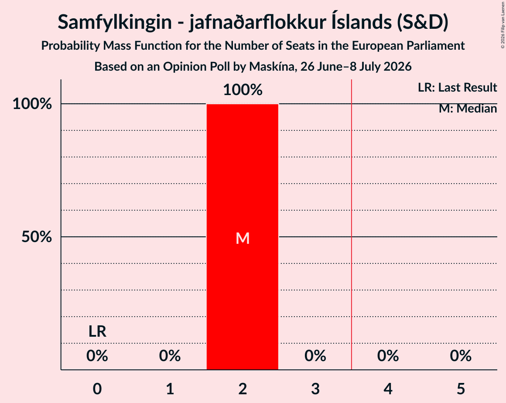

| Number of Seats | Probability | Accumulated | Special Marks |
|:---------------:|:-----------:|:-----------:|:-------------:|
| 0 | 0% | 100% | Last Result |
| 1 | 0% | 100% |  |
| 2 | 100% | 100% | Median |

### Miðflokkurinn (ECR)

*For a full overview of the results for this party, see the [Miðflokkurinn (ECR)](party-miðflokkurinnecr.html) page.*

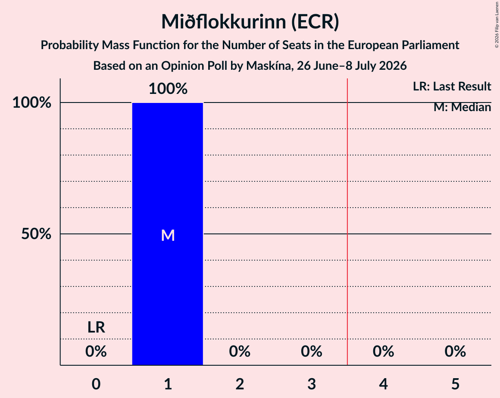

| Number of Seats | Probability | Accumulated | Special Marks |
|:---------------:|:-----------:|:-----------:|:-------------:|
| 0 | 0% | 100% | Last Result |
| 1 | 100% | 100% | Median |

### Viðreisn (RE)

*For a full overview of the results for this party, see the [Viðreisn (RE)](party-viðreisnre.html) page.*

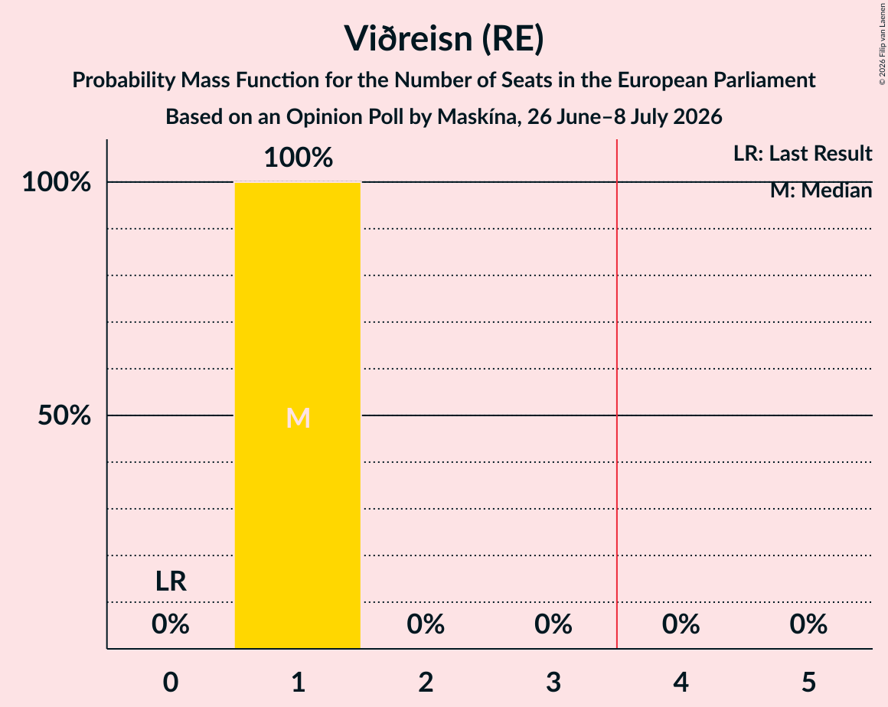

| Number of Seats | Probability | Accumulated | Special Marks |
|:---------------:|:-----------:|:-----------:|:-------------:|
| 0 | 0% | 100% | Last Result |
| 1 | 100% | 100% | Median |

### Framsóknarflokkurinn (RE)

*For a full overview of the results for this party, see the [Framsóknarflokkurinn (RE)](party-framsóknarflokkurinnre.html) page.*

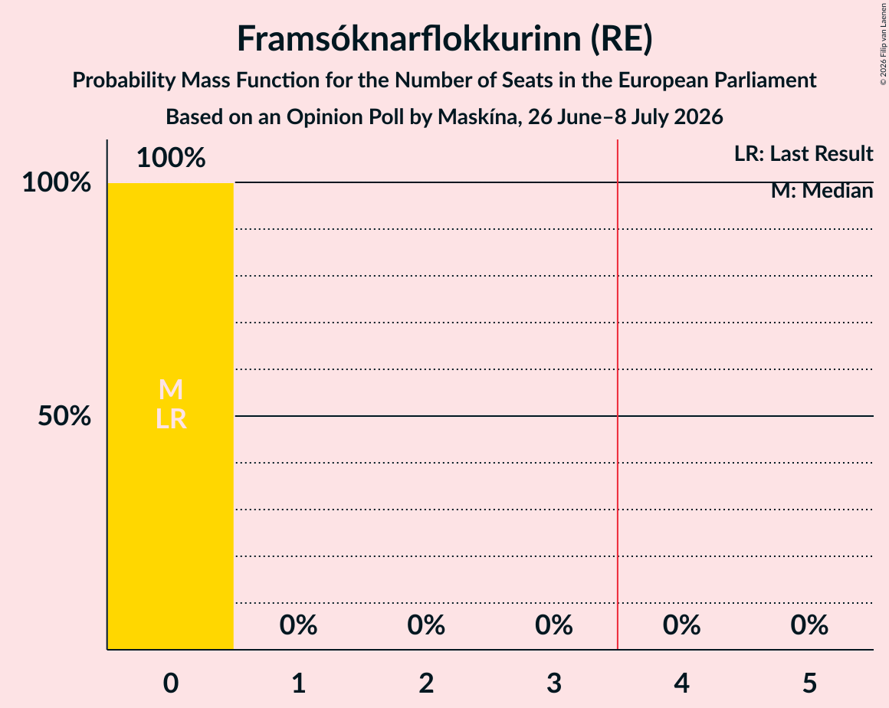

| Number of Seats | Probability | Accumulated | Special Marks |
|:---------------:|:-----------:|:-----------:|:-------------:|
| 0 | 100% | 100% | Last Result, Median |

### Flokkur fólksins (S&D)

*For a full overview of the results for this party, see the [Flokkur fólksins (S&D)](party-flokkurfólksinssd.html) page.*

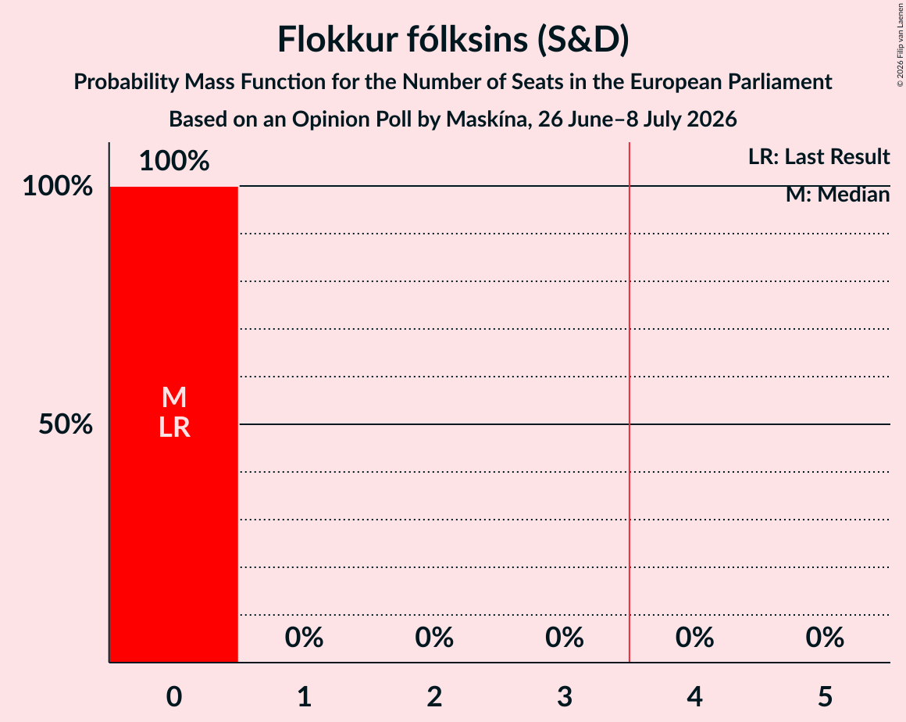

| Number of Seats | Probability | Accumulated | Special Marks |
|:---------------:|:-----------:|:-----------:|:-------------:|
| 0 | 100% | 100% | Last Result, Median |

### Vinstrihreyfingin – grænt framboð (GUE/NGL)

*For a full overview of the results for this party, see the [Vinstrihreyfingin – grænt framboð (GUE/NGL)](party-vinstrihreyfingin–græntframboðguengl.html) page.*

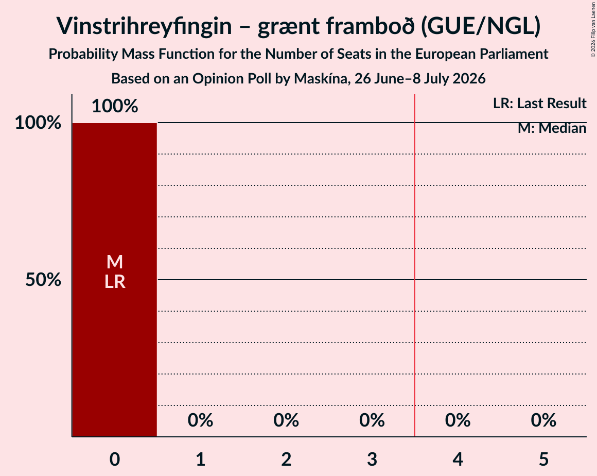

| Number of Seats | Probability | Accumulated | Special Marks |
|:---------------:|:-----------:|:-----------:|:-------------:|
| 0 | 100% | 100% | Last Result, Median |

### Sósíalistaflokkur Íslands (*)

*For a full overview of the results for this party, see the [Sósíalistaflokkur Íslands (*)](party-sósíalistaflokkuríslands.html) page.*

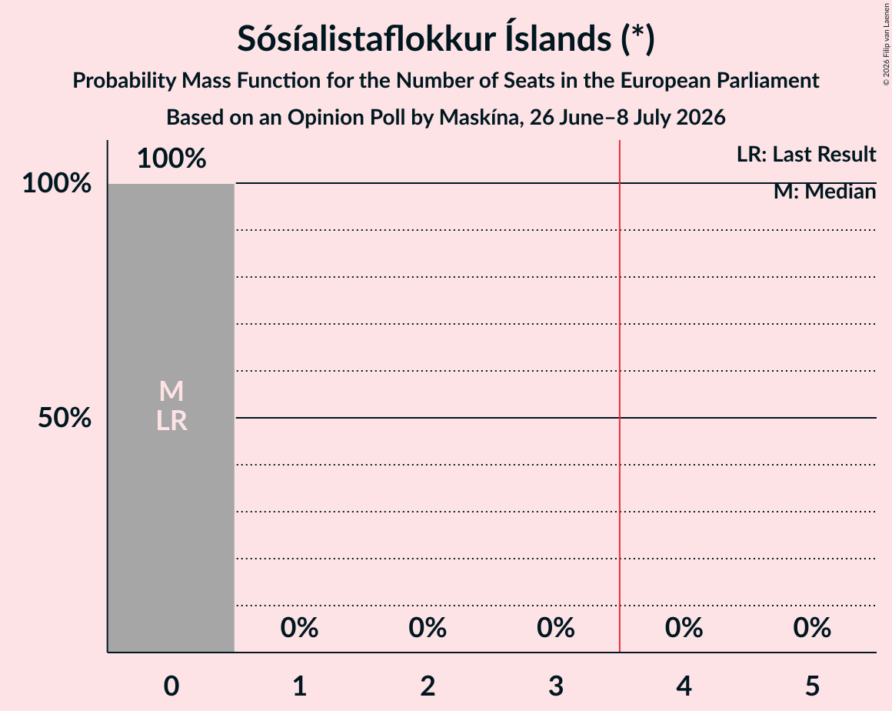

| Number of Seats | Probability | Accumulated | Special Marks |
|:---------------:|:-----------:|:-----------:|:-------------:|
| 0 | 100% | 100% | Last Result, Median |

### Píratar (Greens/EFA)

*For a full overview of the results for this party, see the [Píratar (Greens/EFA)](party-píratargreensefa.html) page.*

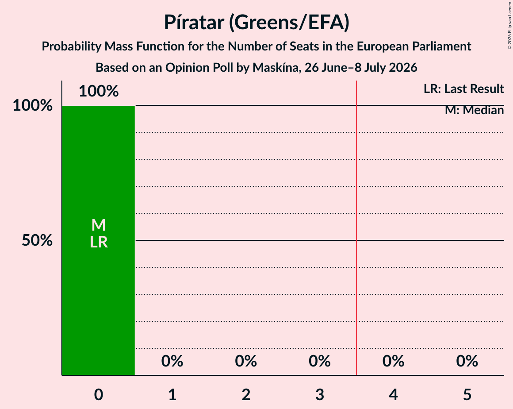

| Number of Seats | Probability | Accumulated | Special Marks |
|:---------------:|:-----------:|:-----------:|:-------------:|
| 0 | 100% | 100% | Last Result, Median |

## Coalitions

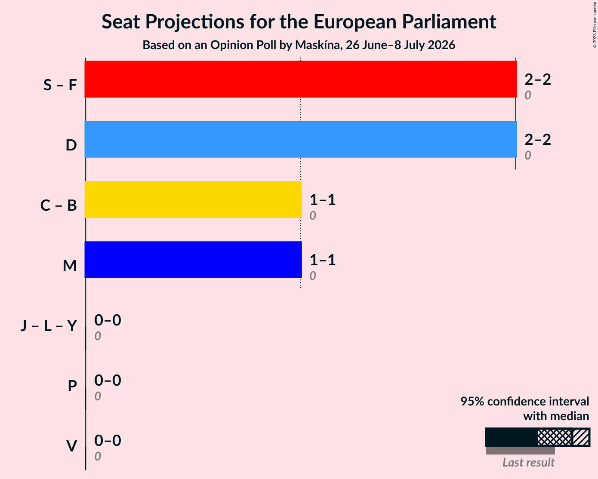

### Confidence Intervals

| Coalition | Last Result | Median | Majority? | 80% Confidence Interval | 90% Confidence Interval | 95% Confidence Interval | 99% Confidence Interval |
|:---------:|:-----------:|:------:|:---------:|:-----------------------:|:-----------------------:|:-----------------------:|:-----------------------:|
| Samfylkingin - jafnaðarflokkur Íslands (S&D) – Flokkur fólksins (S&D) | 0 | 2 | 0% | 2 | 2 | 2 | 2 |
| Sjálfstæðisflokkurinn (EPP) | 0 | 2 | 0% | 2 | 2 | 2 | 2 |
| Viðreisn (RE) – Framsóknarflokkurinn (RE) | 0 | 1 | 0% | 1 | 1 | 1 | 1 |
| Miðflokkurinn (ECR) | 0 | 1 | 0% | 1 | 1 | 1 | 1 |
| Píratar (Greens/EFA) | 0 | 0 | 0% | 0 | 0 | 0 | 0 |
| Vinstrihreyfingin – grænt framboð (GUE/NGL) | 0 | 0 | 0% | 0 | 0 | 0 | 0 |

### Samfylkingin - jafnaðarflokkur Íslands (S&D) – Flokkur fólksins (S&D)

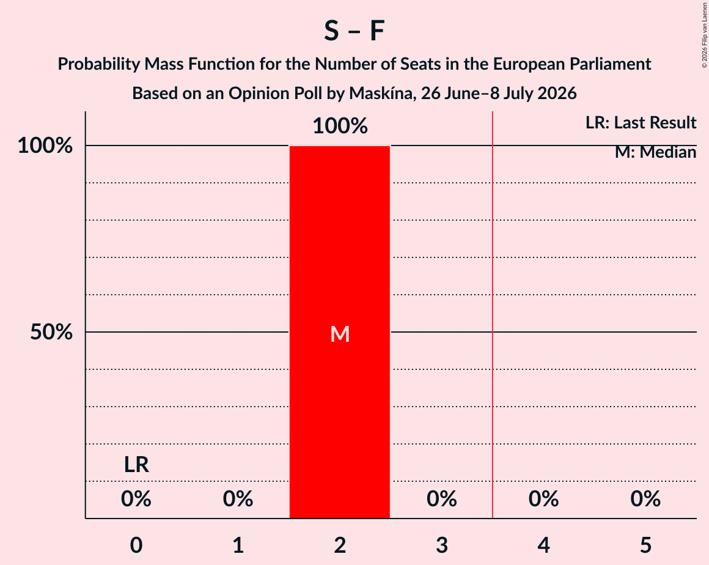

| Number of Seats | Probability | Accumulated | Special Marks |
|:---------------:|:-----------:|:-----------:|:-------------:|
| 0 | 0% | 100% | Last Result |
| 1 | 0% | 100% |  |
| 2 | 100% | 100% | Median |

### Sjálfstæðisflokkurinn (EPP)

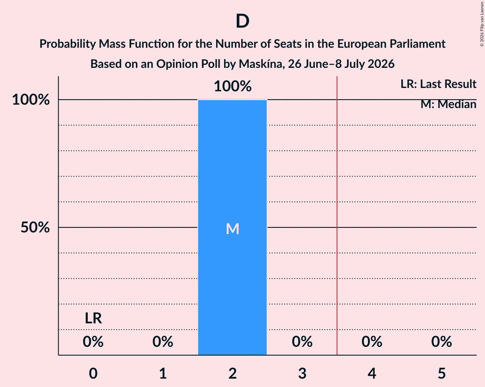

| Number of Seats | Probability | Accumulated | Special Marks |
|:---------------:|:-----------:|:-----------:|:-------------:|
| 0 | 0% | 100% | Last Result |
| 1 | 0% | 100% |  |
| 2 | 100% | 100% | Median |

### Viðreisn (RE) – Framsóknarflokkurinn (RE)

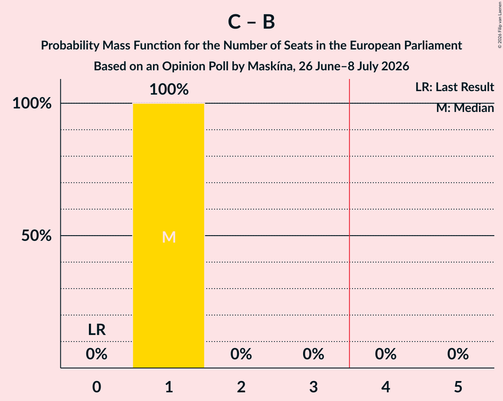

| Number of Seats | Probability | Accumulated | Special Marks |
|:---------------:|:-----------:|:-----------:|:-------------:|
| 0 | 0% | 100% | Last Result |
| 1 | 100% | 100% | Median |

### Miðflokkurinn (ECR)

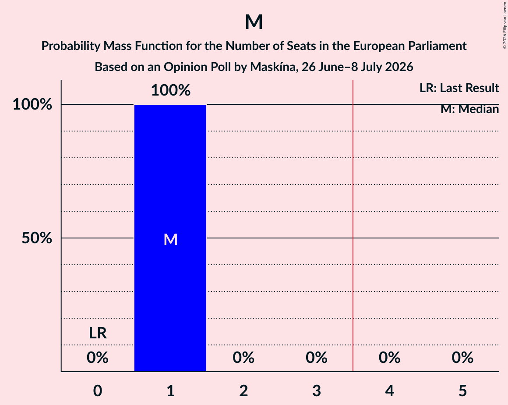

| Number of Seats | Probability | Accumulated | Special Marks |
|:---------------:|:-----------:|:-----------:|:-------------:|
| 0 | 0% | 100% | Last Result |
| 1 | 100% | 100% | Median |

### Píratar (Greens/EFA)

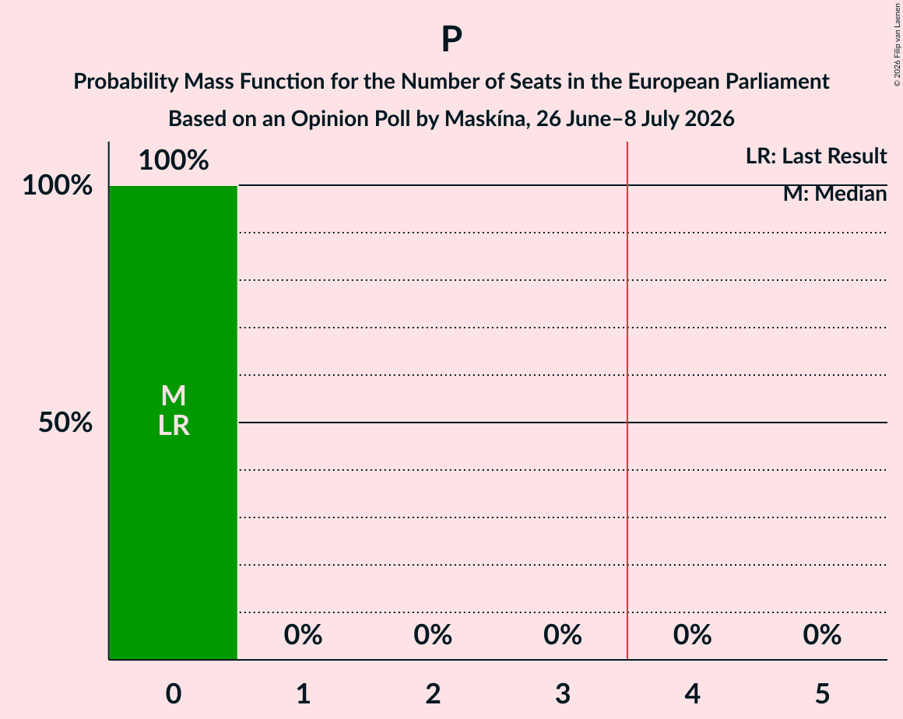

| Number of Seats | Probability | Accumulated | Special Marks |
|:---------------:|:-----------:|:-----------:|:-------------:|
| 0 | 100% | 100% | Last Result, Median |

### Vinstrihreyfingin – grænt framboð (GUE/NGL)

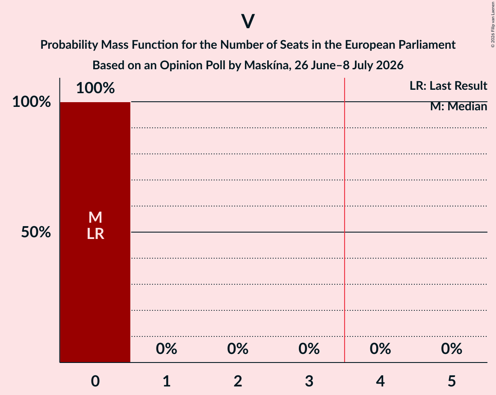

| Number of Seats | Probability | Accumulated | Special Marks |
|:---------------:|:-----------:|:-----------:|:-------------:|
| 0 | 100% | 100% | Last Result, Median |

## Technical Information

### Opinion Poll

+ **Polling firm:** Maskína
+ **Commissioner(s):** —
+ **Fieldwork period:** 26 June–8 July 2026

### Calculations

+ **Sample size:** 964
+ **Simulations done:** 1,048,576
+ **Error estimate:** 2.71%

